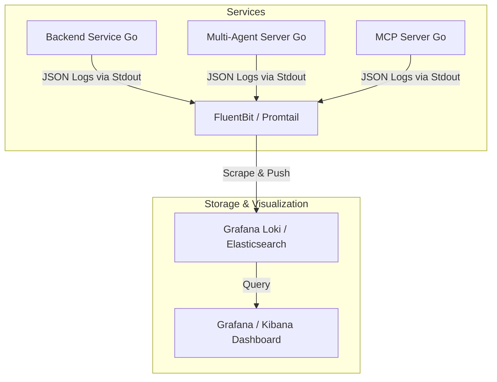

# Hệ thống Logging Cấu trúc & Định danh Liên kết (Structured Logging & Distributed Tracing Correlation)

Tài liệu này thiết kế kiến trúc hệ thống logging chuẩn hóa cho hệ sinh thái Go (Backend Go, Multi-Agent Server Go, MCP Server Go) nhằm giải quyết khó khăn khi debug phân tán qua nhiều service.

---

## 1. Phân biệt các trường Định danh (Identifiers Rationale)

Trong hệ thống microservices và AI Agents, các định danh dễ bị nhầm lẫn vì đều là dạng UUID/chuỗi ký tự ngẫu nhiên. Bảng dưới đây phân định rõ ý nghĩa, phạm vi và lý do cần thiết của từng trường:

| Trường (Field) | Phạm vi (Scope) | Ý nghĩa nghiệp vụ | Lý do cần thiết (Rationale) |
| :--- | :--- | :--- | :--- |
| **`trace_id`** | **Yêu cầu HTTP** *(Request-scoped)* | Đại diện cho **một lượt gửi yêu cầu HTTP duy nhất** từ client đi qua toàn bộ các service (Backend -> Multi-Agent -> MCP). | Dùng để gom tất cả các dòng log phát sinh từ một hành động bấm nút của người dùng để phân tích luồng xử lý liên dịch vụ. |
| **`span_id`** | **Tác vụ cục bộ** *(Operation-scoped)* | Đại diện cho **một hàm hoặc tác vụ xử lý cụ thể** bên trong một dịch vụ duy nhất (ví dụ: Gọi DB, gọi LLM, kiểm tra Auth). | Dùng để xác định chính xác bước xử lý nào trong luồng API đang bị chậm hoặc phát sinh lỗi. Một `trace_id` chứa nhiều `span_id`. |
| **`session_id`** | **Phiên chat AI** *(Chat Session-scoped)* | Đại diện cho **cuộc hội thoại lâu dài giữa User và Agent**, kéo dài qua **nhiều lượt chat (nhiều HTTP requests)**. | Dùng để lọc toàn bộ lịch sử trao đổi, ngữ cảnh hội thoại của một khách hàng với AI qua nhiều ngày hoặc nhiều lượt tương tác. |
| **`user_id`** | **Tài khoản người dùng** *(User-scoped)* | Đại diện cho **khách hàng/tài khoản** đang đăng nhập hệ thống. Kéo dài trọn đời của tài khoản. | Dùng để tra cứu lịch sử hành vi hoặc gỡ lỗi riêng cho một tài khoản cụ thể khi khách hàng đó gửi báo cáo lỗi (support ticket). |

---

## 2. Mô hình Kiến trúc Log Pipeline



---

## 3. Định dạng Log Chuẩn hóa (Standard Log Schema)

Mỗi log entry dạng JSON của tất cả các dịch vụ phải tuân thủ schema dưới đây:

```json
{
  "timestamp": "2026-06-17T16:55:42+07:00",
  "level": "INFO",
  "service.name": "multi-agent",
  "message": "Orschestrator successfully routed request to qa_agent",
  "trace_id": "4bf92f3577b34da6a3ce929d0e0e4736",
  "span_id": "00f067aa0ba902b7",
  "session_id": "e03b13e9-3a54-41ef-89ce-2d371bc230b3",
  "user_id": "9fa995fc-978c-43aa-bd3e-a90965512c24"
}
```

---

## 4. Vai trò của Middleware vs Global Logger

Để việc logging tự động hóa tối đa và lập trình viên không phải truyền thủ công các ID này vào mọi câu lệnh log, hệ thống sẽ kết hợp giữa **Middleware** và **Logger toàn cục (Logger Context)**:

### 4.1. Nhiệm vụ của Middleware
Khi một yêu cầu (request) đi vào bất kỳ service nào, Middleware sẽ tự động thực hiện 3 việc:
1. **Liên kết trace context:** Trích xuất `traceparent` từ header để đồng bộ `trace_id`, hoặc tự tạo mới nếu là điểm đầu của hệ thống.
2. **Nạp thông tin nghiệp vụ vào Context:** Giải mã JWT Token lấy `user_id` và lấy `session_id` từ request body, sau đó nạp các giá trị này vào `context.Context` của request Go:
   ```go
   ctx = context.WithValue(ctx, "user_id", extractedUserID)
   ctx = context.WithValue(ctx, "session_id", extractedSessionID)
   ```
3. **Log Request/Response tự động:** Ghi log tự động khi API bắt đầu nhận và khi trả phản hồi (đường dẫn URL, phương thức, mã HTTP code, thời gian xử lý) để giám sát hiệu năng tổng thể.

### 4.2. Nhiệm vụ của Global Logger (Context Logger)
Logger toàn cục được cấu hình một `Handler` tùy chỉnh để lắng nghe các lệnh log. Thay vì ghi log trực tiếp (`slog.Info(...)`), lập trình viên sẽ ghi log kèm context:
```go
slog.InfoContext(ctx, "Successfully fetched product details", slog.String("sku", productSKU))
```
Khi `slog.InfoContext` được gọi, `OtelHandler` sẽ tự động đọc `trace_id`, `span_id`, `user_id`, `session_id` đang nằm trong `ctx` và đính kèm vào JSON log đầu ra. Lập trình viên chỉ cần ghi thông điệp nghiệp vụ đơn giản.

---

## 5. Thiết kế Triển khai code Go (`log/slog`)

Sử dụng thư viện **`log/slog`** mặc định của Go (từ bản 1.21):

### Custom Handler để tự động đính kèm thông tin từ Context:
```go
package logging

import (
	"context"
	"log/slog"
	"go.opentelemetry.io/otel/trace"
)

type OtelHandler struct {
	slog.Handler
}

func (h *OtelHandler) Handle(ctx context.Context, r slog.Record) error {
	// 1. Trích xuất trace_id và span_id từ OpenTelemetry span trong context
	if span := trace.SpanFromContext(ctx); span.IsRecording() {
		r.AddAttrs(
			slog.String("trace_id", span.SpanContext().TraceID().String()),
			slog.String("span_id", span.SpanContext().SpanID().String()),
		)
	}

	// 2. Trích xuất user_id và session_id do Middleware nạp vào context
	if uID, ok := ctx.Value("user_id").(string); ok && uID != "" {
		r.AddAttrs(slog.String("user_id", uID))
	}
	if sID, ok := ctx.Value("session_id").(string); ok && sID != "" {
		r.AddAttrs(slog.String("session_id", sID))
	}

	return h.Handler.Handle(ctx, r)
}
```

### Cách sử dụng trong code xử lý (Handlers/Repositories):
```go
// Gọi logger thông qua Context
slog.InfoContext(ctx, "Connected to Redis instance successfully")
slog.ErrorContext(ctx, "Failed to update user profile", slog.String("err", err.Error()))
```

---

## 6. Đề xuất Công cụ Quản lý & Xem Log

*   **Grafana Loki:** Cực kỳ phù hợp cho hệ thống hiện tại vì cấu trúc lưu trữ gọn nhẹ (chỉ index metadata và label chứ không index toàn bộ text như Elasticsearch), giúp tiết kiệm tài nguyên.
*   **Grafana Dashboard:** Tạo một bảng điều khiển trung tâm giúp bạn:
    *   Truy vấn log theo `session_id` để xem toàn bộ lịch sử trò chuyện của một cuộc gọi AI.
    *   Chuyển nhanh từ một Log bị lỗi (Error) sang sơ đồ Trace Timeline tương ứng (thông qua Grafana Tempo) để xem chính xác API nào hay sub-agent nào bị lỗi 503/500.
