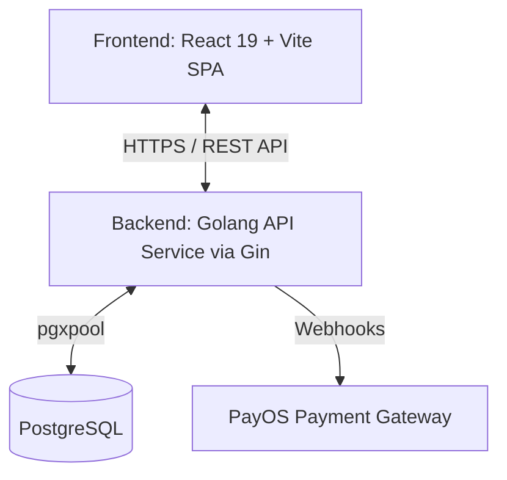
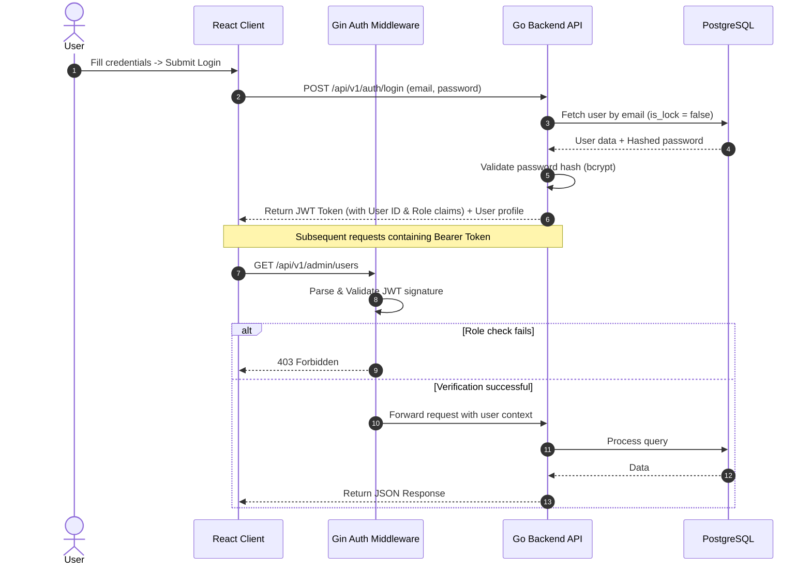
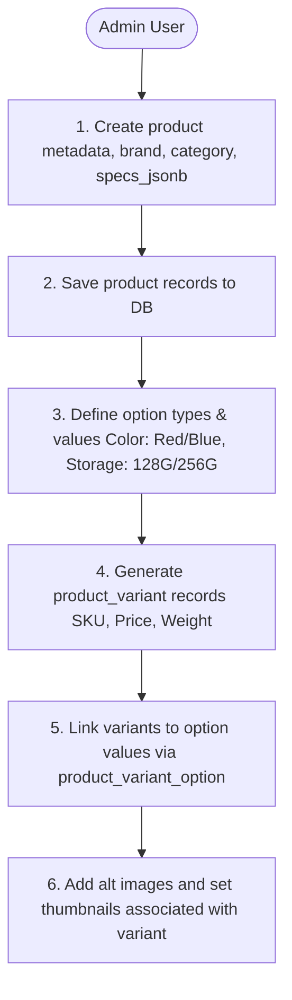
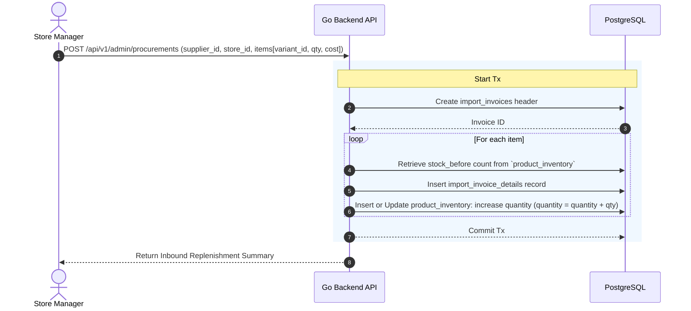

# System Design Document: E-Commerce Platform (Exhaustive Edition)

This design document provides an in-depth breakdown of the E-commerce platform. It maps out all PostgreSQL tables defined in [init-db.sql](file:///d:/Project/Go-Project/infrastructure/docker.config/database/init-db.sql) and details the implementation blueprint for both Frontend (React 19 + Vite SPA) and Backend (Go + Gin Gonic).

---

## 1. System Architecture & Tech Stack



### Architecture Decisions
*   **Backend Project Layout**: Follows standard Go Clean Architecture. The domain entities are pure Go structs defined in `internal/domain`, isolated from database engines or routers.
*   **Database access**: Parameterized raw SQL executed via `pgx/v5` with connection pooling (`pgxpool`).
*   **Router**: **Gin Gonic** for fast routing, binding, and error middleware.
*   **Aesthetic Direction**: **Luxury Refined / Editorial Modern** (deep matte charcoal, ivory white, gold/brass accents, Playfair Display + Plus Jakarta Sans fonts).
*   **Search**: Strictly keyword-based BM25 index over `product` tables (using ParadeDB's `pg_search`). Vector search is skipped for the e-commerce client and reserved exclusively for the AI RAG module.

---

## 2. Comprehensive Module-by-Module Design

The system is organized into **7 specialized functional modules** mapping to the schema.

---

### Module 1: User Identity, Addresses & Security (Customer & Admin)
This module handles user profiles, session authorizations, role permissions (`customer`, `admin`, `store_manager`), delivery addresses, and account safety lockouts.

#### Table Mappings
*   `users` (Stores credentials, roles, avatar, lock status, verification status)
*   `address` (Stores multiple delivery addresses per user with default address indicators)

#### Domain Model (Go)
```go
package domain

import (
	"time"
)

type User struct {
	ID         int       `json:"id" db:"id"`
	FullName   string    `json:"full_name" db:"full_name"`
	Email      string    `json:"email" db:"email"`
	Password   string    `json:"-" db:"password"`
	Phone      *string   `json:"phone" db:"phone"`
	Gender     *string   `json:"gender" db:"gender"`
	DOB        *time.Time `json:"dob" db:"dob"`
	Role       string    `json:"role" db:"role"` // customer, admin, store_manager
	Avatar     *string   `json:"avatar" db:"avatar"`
	IsLock     bool      `json:"is_lock" db:"is_lock"`
	IsVerified bool      `json:"is_verified" db:"is_verified"`
	CreatedAt  time.Time `json:"created_at" db:"created_at"`
	UpdatedAt  time.Time `json:"updated_at" db:"updated_at"`
}

type Address struct {
	ID            int    `json:"id" db:"id"`
	UserID        int    `json:"user_id" db:"user_id"`
	FullName      string `json:"full_name" db:"full_name"`
	Phone         string `json:"phone" db:"phone"`
	District      string `json:"district" db:"district"`
	Province      string `json:"province" db:"province"`
	Ward          string `json:"ward" db:"ward"`
	DetailAddress string `json:"detail_address" db:"detail_address"`
	IsDefault     bool   `json:"is_default" db:"is_default"`
}
```

#### Authentication & Authorization Flow


#### Key API Endpoints
*   `POST /api/v1/auth/register` (Register customer)
*   `POST /api/v1/auth/login` (Generate access token)
*   `GET /api/v1/profile` (Get active profile, requires authentication)
*   `GET /api/v1/addresses` (List user addresses)
*   `POST /api/v1/addresses` (Add new address)
*   `PUT /api/v1/addresses/:id/default` (Set default delivery destination)
*   `PUT /api/v1/admin/users/:id/lock` (Lock/Unlock account, Admin-only)

---

### Module 2: Catalog Taxonomy & Specifications Management
Responsible for organizing hierarchical categories, brand registries, specifications lists, option types/values, and creating variants with alt images.

#### Table Mappings
*   `category`, `brand` (Filing and catalog routing directories)
*   `product`, `product_spec` (Core product details and feature checklists)
*   `product_option_type`, `product_option_value` (Variant characteristics, e.g. Color -> Gold, Size -> 256GB)
*   `product_variant`, `product_variant_option` (Actual SKU units containing prices and weights)
*   `product_image` (Alt galleries associated with products and specific variants)

#### Database Querying (Specs & Options Mapping)
To dynamic display attributes on the Frontend, the backend resolves the relations:
```sql
-- Retrieve all options and values available for a product
SELECT pot.name AS option_name, pov.id AS option_value_id, pov.value AS option_value
FROM product_option_type pot
JOIN product_option_value pov ON pot.id = pov.option_type_id
WHERE pot.product_id = $1;
```

#### Admin Product Creation Flow


#### Key API Endpoints
*   `GET /api/v1/categories` (Fetch hierarchical category tree structure)
*   `GET /api/v1/brands` (Fetch active brands)
*   `GET /api/v1/products` (Search and list products matching category, brand, and JSONB specs filters)
*   `GET /api/v1/products/:id` (Fetch details including option configurations, image gallery, specs list, and dynamic variant configurations)
*   `POST /api/v1/admin/products` (Admin: Create product catalog metadata)
*   `POST /api/v1/admin/products/:id/variants` (Admin: Generate variants and options)

---

### Module 3: Catalog BM25 Search Engine
Handles high-speed keyword search. It leverages PostgreSQL ParadeDB `pg_search` BM25 search over product metadata, category data, and brand directories.

#### Table Mappings
*   `product` (Indices built on product `name` and `meta_description`)

#### Database Search Query Construction
```go
func (r *PostgresCatalogRepository) SearchBM25(ctx context.Context, queryText string, limit, offset int) ([]domain.Product, error) {
	// Execute BM25 search using pg_search tokenizer
	query := `
		SELECT p.id, p.name, p.slug, p.img_thumb, p.specs_jsonb
		FROM product p
		JOIN knowledge_base_search_bm25_index ON p.id = key_field
		WHERE is_deleted = false AND is_active = true
		ORDER BY bm25_score(p.id, $1) DESC
		LIMIT $2 OFFSET $3`

	rows, err := r.pool.Query(ctx, query, queryText, limit, offset)
	if err != nil {
		return nil, fmt.Errorf("bm25 query failure: %w", err)
	}
	defer rows.Close()

	return pgx.CollectRows(rows, pgx.RowToStructByName[domain.Product])
}
```

#### Key API Endpoints
*   `GET /api/v1/search?q=query` (Keyword-only catalog search)

---

### Module 4: Cart & Dynamic Inventory Reservation
Handles shopping cart actions, and safeguards against overselling during checkout via short-term reservations.

#### Table Mappings
*   `cart_items` (Stores temporary items for guest `session_id` and logged-in `user_id`)
*   `product_inventory` (Main stock tracking per variant per store)
*   `inventory_reservations` (Holds reserved stock for 15 minutes during checkout check)

#### Transactional Reservation Logic (Go)
```go
func (r *PostgresInventoryRepository) ReserveStock(ctx context.Context, reservationID string, userID int, storeID int, items []domain.ReservationItem) error {
	tx, err := r.pool.Begin(ctx)
	if err != nil {
		return err
	}
	defer tx.Rollback(ctx)

	for _, item := range items {
		// 1. Lock inventory row for update
		var quantity, reserved int
		query := `SELECT quantity, reserved FROM product_inventory WHERE variant_id = $1 AND store_id = $2 FOR UPDATE`
		err = tx.QueryRow(ctx, query, item.VariantID, storeID).Scan(&quantity, &reserved)
		if err != nil {
			return fmt.Errorf("locking stock: %w", err)
		}

		// 2. Validate availability
		available := quantity - reserved
		if available < item.Quantity {
			return fmt.Errorf("insufficient stock for variant %d: want %d, available %d", item.VariantID, item.Quantity, available)
		}

		// 3. Update reserved count
		updateQuery := `UPDATE product_inventory SET reserved = reserved + $1, last_updated = NOW() WHERE variant_id = $2 AND store_id = $3`
		_, err = tx.Exec(ctx, updateQuery, item.Quantity, item.VariantID, storeID)
		if err != nil {
			return fmt.Errorf("updating reserved count: %w", err)
		}
	}

	// 4. Create reservation log
	resJson, _ := json.Marshal(items)
	insertResQuery := `
		INSERT INTO inventory_reservations (id, user_id, store_id, items, status, expires_at)
		VALUES ($1, $2, $3, $4, 'pending', NOW() + INTERVAL '15 minutes')`
	_, err = tx.Exec(ctx, insertResQuery, reservationID, userID, storeID, resJson)
	if err != nil {
		return fmt.Errorf("inserting reservation record: %w", err)
	}

	return tx.Commit(ctx)
}
```

#### Key API Endpoints
*   `GET /api/v1/cart` (Retrieve cart items)
*   `POST /api/v1/cart` (Add variant to cart)
*   `PUT /api/v1/cart/:id` (Change item quantity)
*   `DELETE /api/v1/cart/:id` (Remove item)
*   `POST /api/v1/reservations` (Trigger temporary stock hold for checkout)

---

### Module 5: Checkout, Promotions, Vouchers & PayOS Payment Gateway
Manages campaign deductions, voucher limit validation, invoice creation, and payment verification via PayOS Webhooks.

#### Table Mappings
*   `orders`, `order_details`, `order_status_history` (Order records and log changes)
*   `promotions` (Product/variant level price reductions)
*   `vouchers`, `voucher_usages` (Cart level discount codes)
*   `order_status`, `payment_status`, `shipping_status` (Status metadata lookup tables)

#### Discount Calculations Logic
```text
Item Variant Price 
   │
   ├──► Apply Promotions (if matching active date range in `promotions` table)
   │      (Result: Item Discounted Price)
   │
   ▼
Accumulate Item Subtotal (A)
   │
   ├──► Apply Voucher Code (verified against requirements in `vouchers` table)
   │      ├─► Validate start_date / end_date
   │      ├─► Validate min_order_value (Subtotal A >= min_order_value)
   │      ├─► Validate max_usage_per_user (user_usages count < max_usage_per_user)
   │      └─► Apply discount amount (capped at max_discount_amount)
   │
   ▼
Final Payment Total = Subtotal (A) + Shipping Price - Voucher Discount
```

#### Key API Endpoints
*   `POST /api/v1/orders` (Convert active reservation into order, apply discounts, and generate PayOS link)
*   `POST /api/v1/payment/payos-webhook` (Verified webhook endpoint handling transaction completions)
*   `GET /api/v1/orders/:id` (Fetch details, status history, and payment progress indicators)
*   `GET /api/v1/admin/orders` (Store manager order review)
*   `PUT /api/v1/admin/orders/:id/status` (Update shipping/order progress state)

---

### Module 6: Procurement & Warehouse Management (Admin & Store Manager)
Handles stock import invoicing, supplier catalogs, and coordinates multi-store coordinates for stock tracking.

#### Table Mappings
*   `store` (Physical store details and locations)
*   `suppliers` (Supplier directories)
*   `import_invoices`, `import_invoice_details` (Restock journals and inbound pricing audits)

#### Inventory Procurement Flow


#### Key API Endpoints
*   `GET /api/v1/admin/stores` (List store locations)
*   `POST /api/v1/admin/stores` (Add physical store registry)
*   `POST /api/v1/admin/suppliers` (Add business supplier record)
*   `POST /api/v1/admin/procurements` (Create import stock invoice, increasing warehouse item quantity)

---

### Module 7: Reviews & Customer Feedback Loop
Handles customer feedback ratings, reviews text submissions, and attached review photo lists.

#### Table Mappings
*   `reviews` (Purchase reviews linked to specific products and validated orders)

#### Review Validation Check
To prevent fake reviews, submissions must verify that:
```sql
SELECT EXISTS (
    SELECT 1 FROM orders o
    JOIN order_details od ON o.id = od.order_id
    WHERE o.user_id = $1 
      AND od.variant_id IN (SELECT id FROM product_variant WHERE product_id = $2)
      AND o.order_status_id = (SELECT id FROM order_status WHERE code = 'completed')
);
```

#### Key API Endpoints
*   `POST /api/v1/reviews` (Submit feedback, verifying prior order validation)
*   `GET /api/v1/products/:id/reviews` (Public: List approved ratings and comments)
*   `GET /api/v1/admin/reviews/pending` (Admin: Fetch feedback queued for content moderation)
*   `PUT /api/v1/admin/reviews/:id/status` (Admin: Approve/reject review entry)

---

## 3. UI Design & Custom Aesthetic Guidelines

### 3.1 Design System Integration
Vite SPA CSS variables matching **Luxury Refined / Editorial Modern** theme details are applied in [index.css](file:///d:/Project/Go-Project/frontend/src/index.css):

```css
:root {
  /* Typography selection */
  --font-display: 'Playfair Display', Georgia, serif;
  --font-body: 'Plus Jakarta Sans', system-ui, sans-serif;

  /* HSL Color Space */
  --bg-primary: hsl(30, 20%, 98%);       /* Warm cream white */
  --bg-secondary: hsl(30, 15%, 94%);     /* Ivory accent */
  --text-primary: hsl(200, 20%, 10%);     /* Deep obsidian */
  --text-muted: hsl(200, 10%, 40%);
  --accent-gold: hsl(36, 60%, 48%);      /* Gold highlight */
  --accent-bronze: hsl(22, 50%, 35%);    /* Warm terracotta contrast */
  --border-subtle: hsla(200, 10%, 20%, 0.08);

  /* Animation definitions */
  --transition-smooth: all 0.4s cubic-bezier(0.16, 1, 0.3, 1);
  --shadow-premium: 0 30px 60px -15px hsla(200, 20%, 10%, 0.06);
}
```

### 3.2 Key Frontend Layout Configurations
*   **Asymmetric Product Catalog Grid**: Staggers product card layouts using CSS Grid grid-area configurations to deliver an elegant, editorial magazine experience.
*   **Variant Swatch Selectors**: Instead of standard drop-downs, uses HSL color swatches and minimal bordered option capsules. Selecting a combination updates the browser URL hash, changes the main product image view with a fade-in animation, and query availability.
*   **Interactive Checkout Portal**: Slide-out pane containing responsive order tracking grids, detailed order breakdown calculations, and a high-contrast PayOS QR Code payment modal with a countdown timer.
*   **Store Manager Operations Board**: Premium tables detailing invoice items, inventory levels with low-stock warnings, and supplier registries.

---

## 4. Verification Plan

### Automated Endpoint Verification
*   **Unit Tests**: Written in Go using standard `testing` and `github.com/stretchr/testify/assert`. We mock database connections via interfaces in `internal/domain` to verify service logic.
*   **API Tests**: Executed directly against the local test database via a custom Makefile wrapper:
    ```bash
    # Run integration tests containing migrations setup and validation queries
    make test-integration
    ```

### Manual Verification
*   Deploy test instance local environment.
*   Run the scraper crawler to collect product items, categories, and review data.
*   Write seed scripts to populate database, and verify the checkout calculations, payment callbacks, and the BM25 search functionality.
