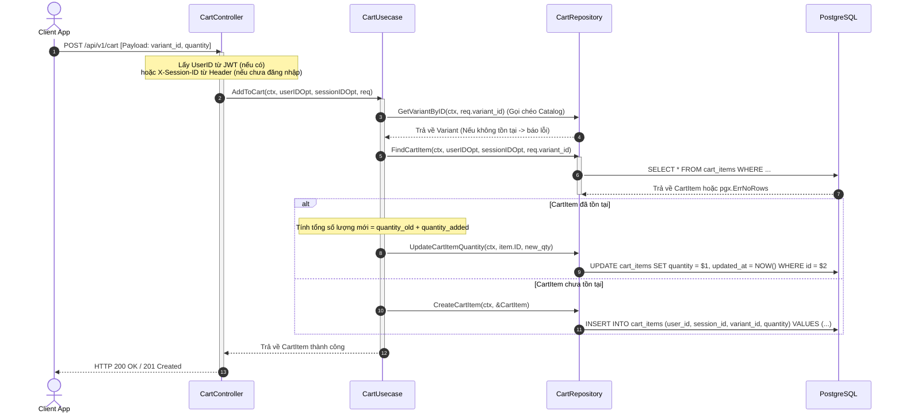
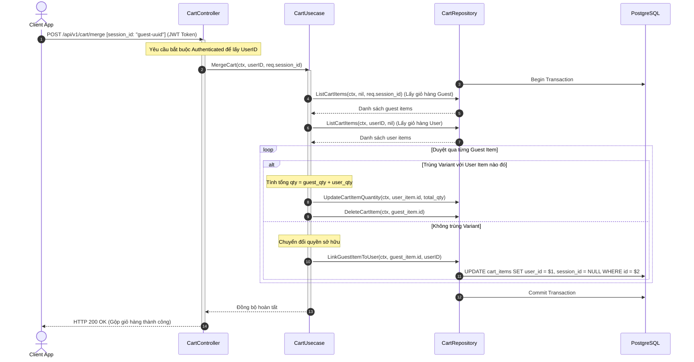
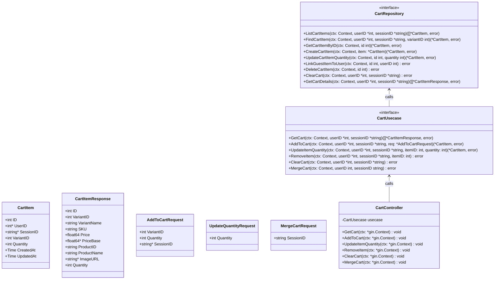

# Thiết Kế Chi Tiết Luồng Giỏ Hàng (Cart Module Design)

Tài liệu này mô tả chi tiết thiết kế hệ thống luồng dữ liệu nghiệp vụ cho module **Giỏ hàng (Cart)**, hỗ trợ cả người dùng vãng lai (Guest - sử dụng `session_id`) và người dùng đã đăng nhập (Authenticated User - sử dụng `user_id`), kèm cơ chế đồng bộ (merge) giỏ hàng khi đăng nhập.

---

## 1. Cấu Trúc Cơ Sở Dữ Liệu (Schema)

Bảng `cart_items` đã được định nghĩa sẵn trong cơ sở dữ liệu:

```sql
CREATE TABLE cart_items (
    id SERIAL PRIMARY KEY,
    user_id INTEGER REFERENCES users(id) ON DELETE CASCADE,
    session_id VARCHAR(100),
    variant_id INTEGER NOT NULL REFERENCES product_variant(id) ON DELETE CASCADE,
    quantity INTEGER NOT NULL CHECK (quantity > 0),
    created_at TIMESTAMPTZ NOT NULL DEFAULT NOW(),
    updated_at TIMESTAMPTZ NOT NULL DEFAULT NOW()
);

-- Chỉ mục tối ưu hóa truy vấn
CREATE INDEX idx_cart_items_user ON cart_items(user_id) WHERE user_id IS NOT NULL;
CREATE INDEX idx_cart_items_session ON cart_items(session_id) WHERE session_id IS NOT NULL;
```

> [!NOTE]
> Bảng `cart_items` có `user_id` và `session_id` đều nullable. 
> - Nếu người dùng chưa đăng nhập: `session_id` được điền, `user_id` = NULL.
> - Nếu người dùng đã đăng nhập: `user_id` được điền, `session_id` = NULL.

---

## 2. Các API Endpoints

Mọi endpoint hỗ trợ cả Guest (qua header `X-Session-ID` hoặc query param `session_id`) và User đã đăng nhập (thông qua JWT Token).

* `GET /api/v1/cart` - Xem giỏ hàng hiện tại (kèm thông tin chi tiết Variant, tên Product, hình ảnh, giá bán, base price).
* `POST /api/v1/cart` - Thêm sản phẩm (variant) vào giỏ hàng.
  * *Request Body*: `{"variant_id": 12, "quantity": 2, "session_id": "optional-guest-uuid"}`
* `PUT /api/v1/cart/items/:id` - Cập nhật số lượng của một mục trong giỏ hàng.
  * *Request Body*: `{"quantity": 5}`
* `DELETE /api/v1/cart/items/:id` - Xóa một mục khỏi giỏ hàng.
* `DELETE /api/v1/cart` - Xóa sạch toàn bộ giỏ hàng.
* `POST /api/v1/cart/merge` - Trộn/Đồng bộ giỏ hàng vãng lai vào tài khoản sau khi đăng nhập (Chỉ yêu cầu Authenticated).
  * *Request Body*: `{"session_id": "guest-uuid"}`

---

## 3. Thiết Kế Luồng Nghiệp Vụ & Sơ đồ Tuần tự (Sequence Diagrams)

### 3.1 Luồng Thêm Vào Giỏ Hàng (Add To Cart Flow)

Khi thêm sản phẩm vào giỏ hàng, hệ thống kiểm tra sự tồn tại của Variant. Nếu sản phẩm đã có trong giỏ hàng của user/session đó, hệ thống sẽ cộng dồn số lượng. Ngược lại, tạo mới một dòng.



---

### 3.2 Luồng Đồng bộ Giỏ hàng (Merge Cart Flow)

Sau khi đăng nhập thành công, Client sẽ gọi API `/api/v1/cart/merge` gửi kèm `session_id` cũ. Hệ thống sẽ gộp tất cả các sản phẩm trong giỏ hàng guest sang giỏ hàng của user.



---

## 4. Đặc Tả Lớp & Cấu Trúc Dữ Liệu (UML Class Diagram)


