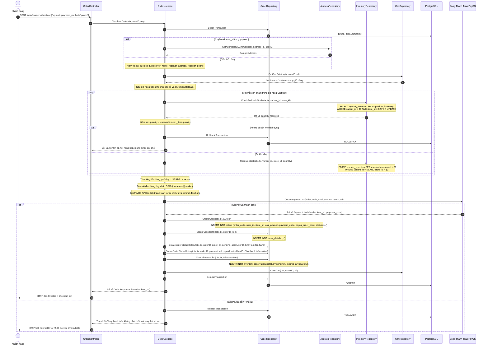
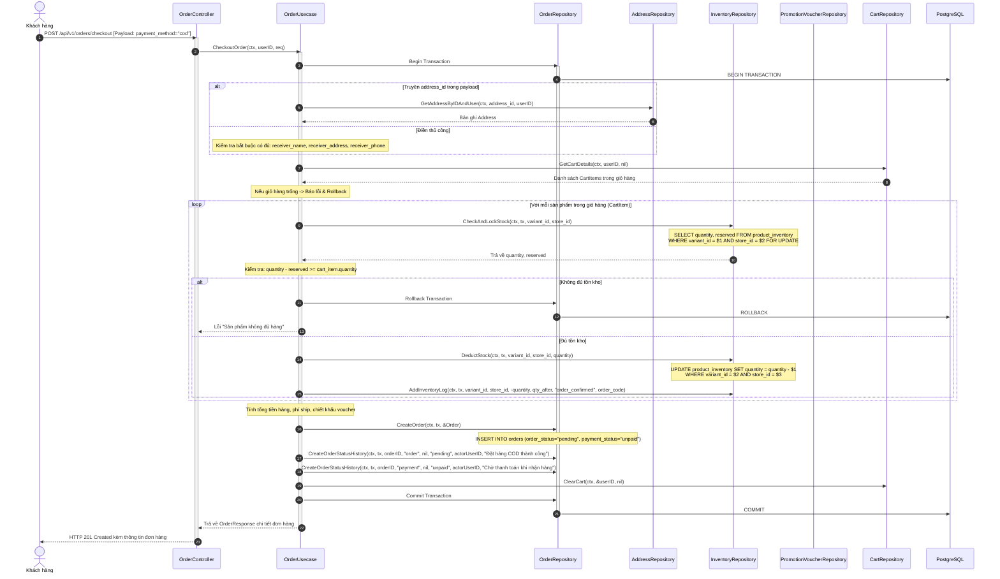
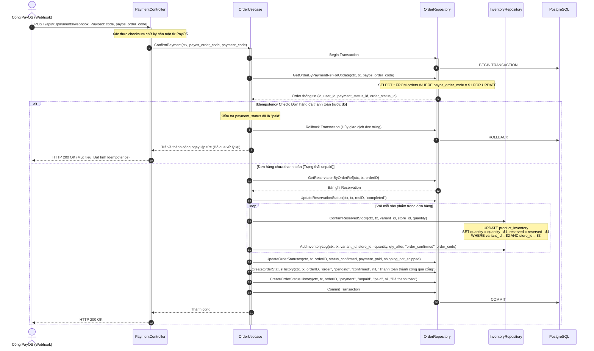
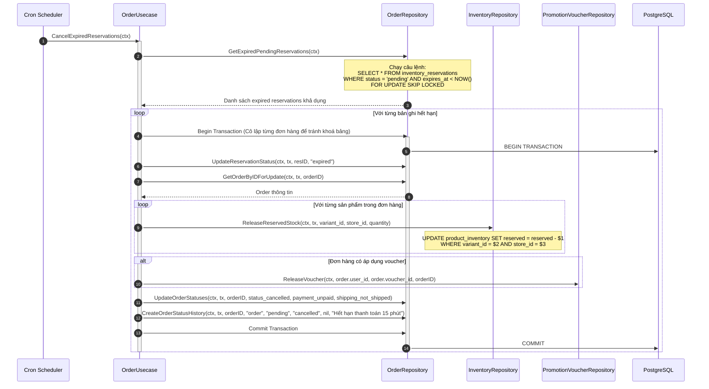

# Thiết Kế Chi Tiết Luồng Đặt Hàng & Thanh Toán (Order & Checkout Module Design)

Tài liệu này mô tả chi tiết thiết kế hệ thống luồng dữ liệu nghiệp vụ cho module **Đặt hàng (Order)** và **Thanh toán (Checkout)**, bao gồm cơ chế giữ hàng/tồn kho tạm thời (Inventory Reservation) cho thanh toán online, trừ kho trực tiếp cho COD, áp dụng mã giảm giá, tính toán phí ship động, tích hợp nhà vận chuyển, và ghi nhận lịch sử trạng thái mới.

---

## 1. Cấu Trúc Cơ Sở Dữ Liệu (Schema)

Các bảng liên quan trong cơ sở dữ liệu:

```sql
-- 1. Danh mục trạng thái đơn hàng (pending, confirmed, processing, shipping, delivered, cancelled)
CREATE TABLE order_status (
    id SERIAL PRIMARY KEY,
    code VARCHAR(50) UNIQUE NOT NULL,
    label VARCHAR(100) NOT NULL,
    sort_order INTEGER NOT NULL DEFAULT 0
);

-- 2. Danh mục trạng thái thanh toán (unpaid, paid, refunded)
CREATE TABLE payment_status (
    id SERIAL PRIMARY KEY,
    code VARCHAR(50) UNIQUE NOT NULL,
    label VARCHAR(100) NOT NULL,
    sort_order INTEGER NOT NULL DEFAULT 0
);

-- 3. Danh mục trạng thái giao hàng (not_shipped, shipped, delivered)
CREATE TABLE shipping_status (
    id SERIAL PRIMARY KEY,
    code VARCHAR(50) UNIQUE NOT NULL,
    label VARCHAR(100) NOT NULL,
    sort_order INTEGER NOT NULL DEFAULT 0
);

-- 4. Bảng Đơn hàng (Orders)
CREATE TABLE orders (
    id SERIAL PRIMARY KEY,
    order_code VARCHAR(100) UNIQUE NOT NULL,
    user_id INTEGER NOT NULL REFERENCES users(id),
    store_id INTEGER NOT NULL REFERENCES store(id),
    voucher_id INTEGER REFERENCES vouchers(id),
    order_status_id INTEGER NOT NULL REFERENCES order_status(id),
    payment_status_id INTEGER NOT NULL REFERENCES payment_status(id),
    shipping_status_id INTEGER NOT NULL REFERENCES shipping_status(id),
    total_amount NUMERIC(15, 2) NOT NULL,
    voucher_discount NUMERIC(15, 2) NOT NULL DEFAULT 0,
    shipping_price NUMERIC(15, 2) NOT NULL DEFAULT 0,
    payment_method VARCHAR(50),               -- "cod", "bank_transfer", "payos"
    payment_code VARCHAR(100),                -- Mã thanh toán tự sinh/tham chiếu
    payos_order_code VARCHAR(100),            -- Mã đơn hàng liên kết cổng PayOS
    note TEXT,
    receiver_name VARCHAR(255) NOT NULL,
    receiver_address TEXT NOT NULL,
    receiver_phone VARCHAR(50) NOT NULL,
    sender_name VARCHAR(255),
    sender_address TEXT,
    sender_phone VARCHAR(50),
    shipping_provider  VARCHAR(50),           -- Nhà vận chuyển: "ghn", "ghtk"
    shipping_code      VARCHAR(100),          -- Mã vận đơn
    created_at TIMESTAMPTZ NOT NULL DEFAULT NOW(),
    updated_at TIMESTAMPTZ NOT NULL DEFAULT NOW()
);

-- 5. Bảng Chi tiết Đơn hàng (Order Details)
CREATE TABLE order_details (
    id SERIAL PRIMARY KEY,
    order_id INTEGER NOT NULL REFERENCES orders(id) ON DELETE CASCADE,
    variant_id INTEGER NOT NULL REFERENCES product_variant(id),
    quantity INTEGER NOT NULL CHECK (quantity > 0),
    unit_price NUMERIC(15, 2) NOT NULL,
    total_cost NUMERIC(15, 2) NOT NULL
);

-- 6. Bảng Lịch sử thay đổi trạng thái đơn hàng (Order Status History)
CREATE TABLE order_status_history (
    id SERIAL PRIMARY KEY,
    order_id      INTEGER NOT NULL REFERENCES orders(id),
    status_type   VARCHAR(20) NOT NULL,  -- "order", "payment", "shipping"
    from_status   VARCHAR(50),           -- Mã status code cũ (ví dụ "pending", "unpaid")
    to_status     VARCHAR(50) NOT NULL,  -- Mã status code mới (ví dụ "confirmed", "paid")
    changed_by    INTEGER REFERENCES users(id),
    note          TEXT,
    changed_at    TIMESTAMPTZ NOT NULL DEFAULT NOW()
);

-- 7. Bảng Tồn kho tạm thời phục vụ giữ chỗ khi thanh toán online (Inventory Reservations)
CREATE TABLE inventory_reservations (
    id VARCHAR(100) PRIMARY KEY,
    user_id INTEGER NOT NULL REFERENCES users(id) ON DELETE CASCADE,
    store_id INTEGER NOT NULL REFERENCES store(id) ON DELETE CASCADE,
    items JSONB NOT NULL,                     -- Danh sách [{variant_id: X, quantity: Y}]
    status VARCHAR(50) NOT NULL,              -- "pending", "completed", "expired"
    payment_code VARCHAR(100),
    payos_order_code VARCHAR(100),
    expires_at TIMESTAMPTZ NOT NULL,
    created_at TIMESTAMPTZ NOT NULL DEFAULT NOW()
);
```

---

## 2. Các API Endpoints

### 2.1 Khách hàng (Customer Scope - Yêu cầu JWT)
* `POST /api/v1/orders/checkout` - Tạo đơn hàng mới từ giỏ hàng hiện tại.
  * *Request Body*:
    ```json
    {
      "store_id": 1,
      "address_id": 5,              // Trích xuất địa chỉ tự động
      "receiver_name": "",          // Điền thủ công nếu không truyền address_id
      "receiver_address": "",       // Điền thủ công
      "receiver_phone": "",         // Điền thủ công
      "voucher_code": "SUMMER10",   // Tùy chọn
      "payment_method": "payos",    // "cod", "bank_transfer", "payos"
      "shipping_provider": "ghn",   // "ghn", "ghtk"
      "note": "Giao giờ hành chính"
    }
    ```
  * *Response*: 
    - Nếu là **COD**: Trả về trực tiếp chi tiết đơn hàng (Thành công ngay).
    - Nếu là **PAYOS / Online**: Trả về chi tiết đơn hàng (trạng thái `pending` + `unpaid`), kèm link thanh toán PayOS (`checkout_url`) được tạo từ cổng PayOS. Đồng thời tạo bản ghi giữ chỗ tồn kho `inventory_reservations` có hiệu lực trong 15 phút.
* `GET /api/v1/orders` - Xem lịch sử đơn hàng cá nhân (paginated `page`, `limit`).
* `GET /api/v1/orders/:id` - Xem chi tiết một đơn hàng cụ thể.
* `POST /api/v1/orders/:id/cancel` - Khách tự hủy đơn (chỉ được phép khi đơn ở trạng thái `pending` và chưa giao).

### 2.2 Xử lý Webhook Thanh toán (Public - Không yêu cầu Token)
* `POST /api/v1/payments/webhook` - Nhận tín hiệu thanh toán từ PayOS.
  * *Logic*: Xác minh chữ ký PayOS, nếu thanh toán thành công -> Cập nhật trạng thái đơn hàng sang `confirmed`, thanh toán sang `paid`, hoàn tất reservation (`completed`), chính thức trừ kho (`quantity = quantity - qty, reserved = reserved - qty`).

### 2.3 Quản trị viên (Admin Scope - Yêu cầu Quyền Admin)
* `GET /api/v1/admin/orders` - Danh sách toàn bộ đơn hàng (hỗ trợ bộ lọc, phân trang).
* `PUT /api/v1/admin/orders/:id/status` - Cập nhật trạng thái đơn hàng (`order`, `payment`, `shipping`). Có thể tự sinh mã vận đơn `shipping_code` từ provider nếu thay đổi trạng thái sang gửi hàng.
* `POST /api/v1/admin/orders/:id/shipment` - Tạo đơn giao hàng sang bên vận chuyển (GHN/GHTK) thủ công, lấy `shipping_code` cập nhật vào đơn.

---

## 3. Thiết Kế Luồng Nghiệp Vụ & Sơ đồ Tuần tự (Sequence Diagrams)

### 3.1 Luồng Tạo Đơn Hàng Thanh Toán Online (Online Payment Reservation Flow)

#### Nguyên lý tính toán Shipping & Address:
1. **Address Resolution**:
   - Nếu truyền `address_id`: Hệ thống sẽ query bảng `address` của người dùng hiện tại, định dạng chuỗi địa chỉ nhận hàng bằng cách gộp: `detail_address, ward, district, province` và điền `receiver_name`, `receiver_phone` tương ứng.
   - Nếu không truyền `address_id`: Hệ thống bắt buộc truyền thủ công các trường `receiver_name`, `receiver_address`, `receiver_phone`.
2. **Shipping Price**:
   - Mặc định phí ship đồng giá: **30,000 VND**.
   - Nếu tổng giá trị đơn hàng (trước khi trừ voucher) `>= 500,000 VND`: Phí ship sẽ là **0 VND** (Free Ship).

#### Thứ tự thực hiện DB Commit & gọi PayOS:
Để đảm bảo bản ghi đơn hàng trong cơ sở dữ liệu luôn đi kèm đầy đủ các thông tin tham chiếu thanh toán chính xác (`payment_code`, `payos_order_code`) nhằm phục vụ Webhook xác minh về sau:
1. **Gọi PayOS trong Transaction (trước khi Insert)**:
   - Hệ thống khởi tạo Transaction, khóa và kiểm tra tồn kho.
   - Sinh mã đơn hàng (`order_code`) sẵn trong bộ nhớ và thực hiện gọi API của PayOS ngoài mạng.
2. **Nếu PayOS trả về link thanh toán thành công**:
   - Tiến hành INSERT dữ liệu vào bảng `orders` (chứa sẵn `payment_code` và `payos_order_code`), `order_details`, `inventory_reservations` và xóa giỏ hàng.
   - **Commit Transaction**. Đơn hàng và giữ hàng được thiết lập đồng thời một cách nhất quán.
3. **Nếu PayOS lỗi / không phản hồi**:
   - Gọi **Rollback Transaction** ngay lập tức. Toàn bộ các khóa dòng trên `product_inventory` được giải phóng, giỏ hàng được giữ nguyên, và không có đơn hàng lỗi nào được tạo trong DB.



---

### 3.2 Luồng Tạo Đơn Hàng Thanh Toán COD (Cash on Delivery Flow)

Với COD, đơn hàng được coi là tạo thành công ngay mà không cần giữ tồn kho tạm thời, do đó hệ thống sẽ thực hiện trừ trực tiếp tồn kho thực tế (`quantity = quantity - order_qty`) trong transaction tạo đơn.



---

### 3.3 Luồng Xác Nhận Thanh Toán Thành Công (PayOS Webhook - Idempotency Check)

Nhằm chống xử lý trùng lặp (double-processing) khi cổng thanh toán gọi webhook nhiều lần do lỗi mạng, hệ thống bắt buộc phải kiểm tra trạng thái thanh toán hiện tại của đơn hàng (Idempotency Check) trước khi thực hiện trừ kho và cập nhật trạng thái.



---

### 3.4 Luồng Giải Phóng Giữ Chỗ Khi Hết Hạn (Cron Job - Concurrency SKIP LOCKED)

Khi hệ thống chạy multi-instance (nhiều container chạy song song), để tránh tranh chấp dữ liệu và deadlock khi các instance đồng thời quét và hủy đơn hết hạn, câu lệnh truy vấn tìm đơn hết hạn sẽ sử dụng mệnh đề `FOR UPDATE SKIP LOCKED`. Mệnh đề này giúp bỏ qua các dòng đang bị xử lý bởi instance khác.



---

### 3.5 Tích hợp Vận Chuyển (Shipping Integration Trigger Point)

Quy định rõ điểm kích hoạt (**Trigger Point**) gửi thông tin giao hàng đến các nhà vận chuyển (GHN/GHTK):
1. **COD Orders**: Điểm kích hoạt là khi **Admin xác nhận đơn hàng** (thay đổi trạng thái `order_status` từ `pending` -> `confirmed` / `processing`). Lúc này hệ thống tự động gọi API nhà vận chuyển để tạo đơn giao hàng và lấy mã vận đơn `shipping_code`.
2. **Online Payment Orders (PayOS)**: Điểm kích hoạt là khi **Cổng thanh toán gọi Webhook báo thành công** (sau khi đơn hàng tự động đổi trạng thái sang `confirmed`). Tại thời điểm này, hệ thống sẽ thực hiện gọi API nhà vận chuyển để lấy `shipping_code` ngay lập tức.
3. **Các tham số tính phí ship động**: Tích hợp gọi API tính phí trước khi checkout dựa trên địa chỉ khách hàng. Nếu API lỗi, fallback về cơ chế phí ship tĩnh (30k, miễn phí khi đơn >= 500k).

---

## 4. Đặc Tả Lớp & Cấu Trúc Dữ Liệu (UML Class Diagram)

```mermaid
classDiagram
    direction BT

    class Order {
        +int ID
        +string OrderCode
        +int UserID
        +int StoreID
        +int* VoucherID
        +int OrderStatusID
        +int PaymentStatusID
        +int ShippingStatusID
        +float64 TotalAmount
        +float64 VoucherDiscount
        +float64 ShippingPrice
        +string PaymentMethod
        +string* PaymentCode
        +string* PayosOrderCode
        +string* Note
        +string ReceiverName
        +string ReceiverAddress
        +string ReceiverPhone
        +string* SenderName
        +string* SenderAddress
        +string* SenderPhone
        +string* ShippingProvider
        +string* ShippingCode
        +Time CreatedAt
        +Time UpdatedAt
    }

    class OrderDetail {
        +int ID
        +int OrderID
        +int VariantID
        +int Quantity
        +float64 UnitPrice
        +float64 TotalCost
    }

    class OrderStatusHistory {
        +int ID
        +int OrderID
        +string StatusType
        +string* FromStatus
        +string ToStatus
        +int* ChangedBy
        +string* Note
        +Time ChangedAt
    }

    class InventoryReservation {
        +string ID
        +int UserID
        +int StoreID
        +interface Items
        +string Status
        +string* PaymentCode
        +string* PayosOrderCode
        +Time ExpiresAt
        +Time CreatedAt
    }

    class CheckoutOrderRequest {
        +int StoreID
        +int* AddressID
        +string* ReceiverName
        +string* ReceiverAddress
        +string* ReceiverPhone
        +string* VoucherCode
        +string PaymentMethod
        +string* ShippingProvider
        +string* Note
    }

    class UpdateOrderStatusRequest {
        +string* OrderStatusCode
        +string* PaymentStatusCode
        +string* ShippingStatusCode
        +string* ShippingProvider
        +string* ShippingCode
        +string* Note
    }

    class OrderResponse {
        +Order Order
        +[]OrderDetailResponse Items
        +string OrderStatusLabel
        +string PaymentStatusLabel
        +string ShippingStatusLabel
        +string* CheckoutURL
    }

    class OrderDetailResponse {
        +int ID
        +int VariantID
        +string VariantName
        +string SKU
        +int Quantity
        +float64 UnitPrice
        +float64 TotalCost
    }

    class OrderController {
        -OrderUsecase usecase
        +Checkout(ctx: *gin.Context) void
        +ListMyOrders(ctx: *gin.Context) void
        +GetMyOrderDetails(ctx: *gin.Context) void
        +CancelMyOrder(ctx: *gin.Context) void
        +ConfirmPaymentWebhook(ctx: *gin.Context) void
        +AdminListOrders(ctx: *gin.Context) void
        +AdminUpdateStatus(ctx: *gin.Context) void
    }

    class OrderUsecase {
        <<interface>>
        +CheckoutOrder(ctx: Context, userID: int, req: *CheckoutOrderRequest) (*OrderResponse, error)
        +ConfirmPayment(ctx: Context, payosOrderCode string, paymentCode string) error
        +CancelExpiredReservations(ctx: Context) error
        +ListOrders(ctx: Context, userID: *int, storeID: *int, page: int, limit: int) ([]*OrderResponse, int, error)
        +GetOrderDetails(ctx: Context, orderID: int, userID: *int) (*OrderResponse, error)
        +CancelOrder(ctx: Context, orderID: int, actorUserID: int, isAdmin: bool, note: string) error
        +UpdateOrderStatus(ctx: Context, orderID: int, actorUserID: int, req: *UpdateOrderStatusRequest) error
    }

    class OrderRepository {
        <<interface>>
        +CreateOrder(ctx: Context, tx: pgx.Tx, order: *Order) (*Order, error)
        +CreateOrderDetail(ctx: Context, tx: pgx.Tx, detail: *OrderDetail) (*OrderDetail, error)
        +GetOrderByID(ctx: Context, id: int) (*Order, error)
        +GetOrderByIDForUpdate(ctx: Context, tx: pgx.Tx, id: int) (*Order, error)
        +GetOrderByPaymentRefForUpdate(ctx: Context, tx: pgx.Tx, payosOrderCode string) (*Order, error)
        +GetOrderDetails(ctx: Context, orderID: int) ([]*OrderDetailResponse, error)
        +ListOrders(ctx: Context, userID: *int, storeID: *int, page: int, limit: int) ([]*Order, int, error)
        +UpdateOrderStatuses(ctx: Context, tx: pgx.Tx, id: int, orderStatusID: int, paymentStatusID: int, shippingStatusID: int) error
        +UpdateOrderPaymentRefs(ctx: Context, id: int, paymentCode string, payosOrderCode string) error
        
        +CreateOrderStatusHistory(ctx: Context, tx: pgx.Tx, history: *OrderStatusHistory) error
        +GetStatusIDByCode(ctx: Context, statusType: string, code: string) (int, error)
        +GetStatusLabelByID(ctx: Context, statusType: string, id: int) (string, error)

        +CreateReservation(ctx: Context, tx: pgx.Tx, res: *InventoryReservation) error
        +UpdateReservationStatus(ctx: Context, tx: pgx.Tx, id string, status string) error
        +GetReservationByOrderID(ctx: Context, tx: pgx.Tx, orderID int) (*InventoryReservation, error)
        +GetExpiredPendingReservations(ctx: Context) ([]*InventoryReservation, error)
    }

    OrderController --> OrderUsecase : calls
    OrderUsecase --> OrderRepository : calls
