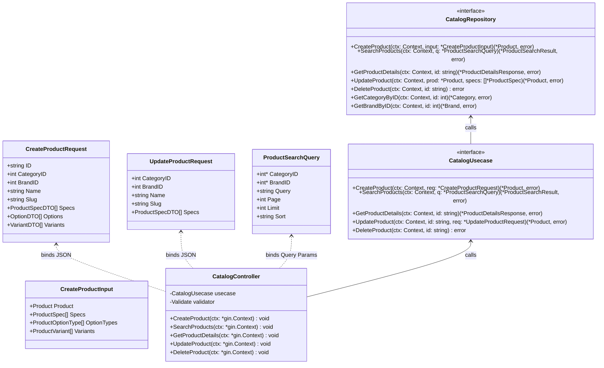
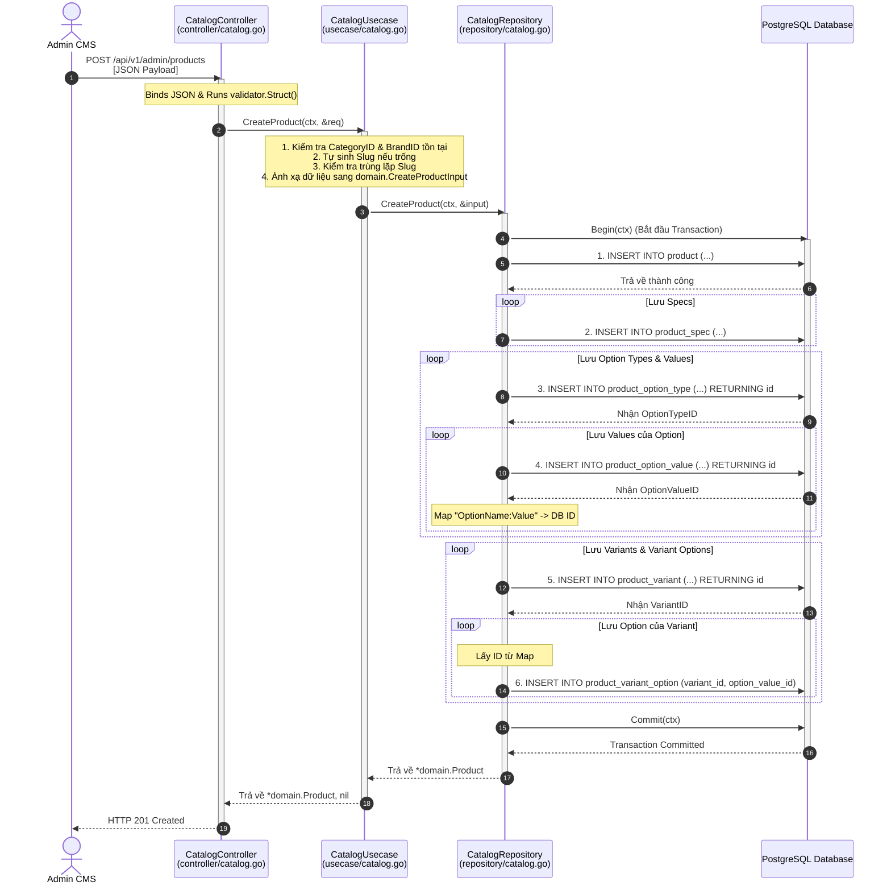
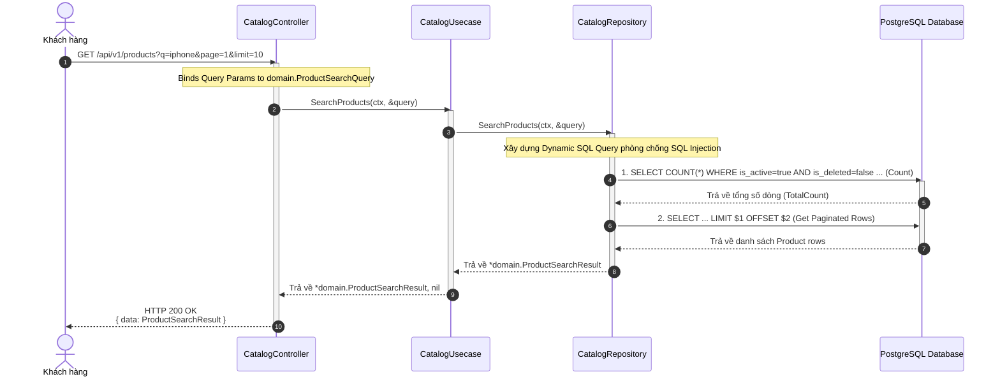
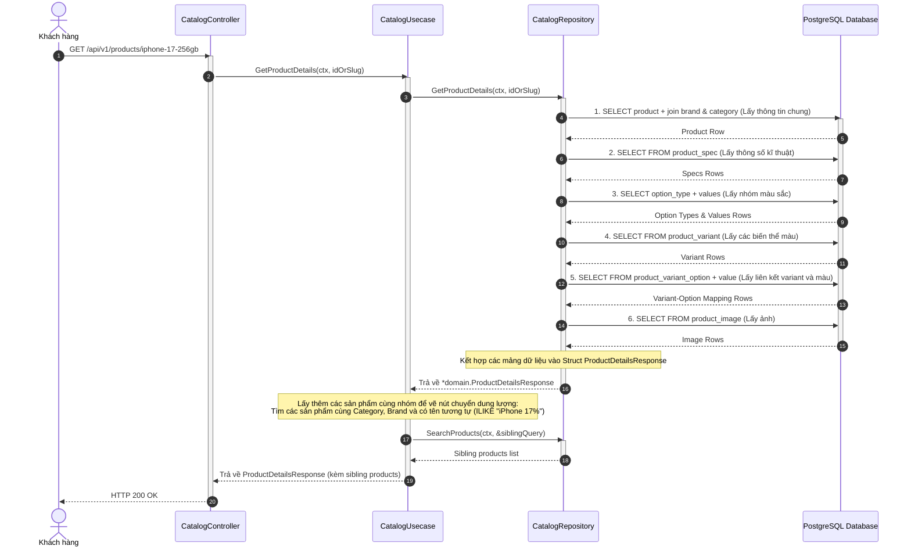
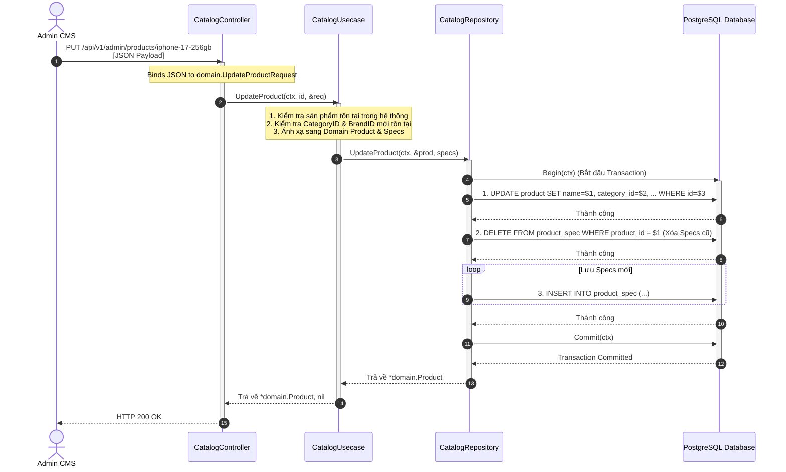
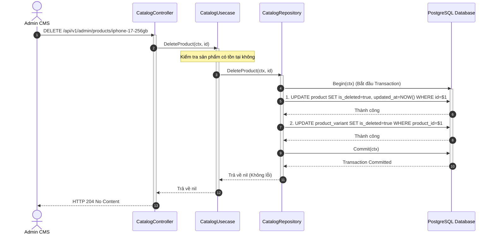

# Thiết Kế Chi Tiết Luồng CRUD Sản Phẩm (Product Catalog Design)
*Tham chiếu mô hình Catalog của Thế Giới Di Động (TGDD)*

Tài liệu này mô tả chi tiết thiết kế hệ thống luồng **CRUD** (Create, Read, Update, Delete) cho thực thể **Sản phẩm (Product)** sau khi đối chiếu và tối ưu theo mô hình thực tế của Thế Giới Di Động (ví dụ trang [iPhone 17 thường](https://www.thegioididong.com/dtdd/iphone-17)).

---

## 1. Phân Tích Mô Hình Catalog Thực Tế (Thế Giới Di Động)

Khi phân tích trang sản phẩm của Thế Giới Di Động, ta thấy hành vi hệ thống được tổ chức như sau:

```
[Dòng sản phẩm gốc: iPhone 17 thường]
   |
   +---> [Sản phẩm bán 1: iPhone 17 128GB] (URL: /dtdd/iphone-17-128gb) -> Specs: 128GB ROM
   |        |
   |        +---> [Biến thể màu 1: Xanh Lá] (Giá: A)
   |        +---> [Biến thể màu 2: Xanh Lam] (Giá: B)
   |
   +---> [Sản phẩm bán 2: iPhone 17 256GB] (URL: /dtdd/iphone-17) -> Specs: 256GB ROM
   |        |
   |        +---> [Biến thể màu 1: Xanh Lá] (Giá: C)
   |        +---> [Biến thể màu 2: Xanh Lam] (Giá: D)
   |
   +---> [Sản phẩm bán 3: iPhone 17 512GB] (URL: /dtdd/iphone-17-512gb) -> Specs: 512GB ROM
```

### Cách TGDD phân cấp và tổ chức:
1. **Sản phẩm bán chính (Product Entity)**: 
   - Mỗi cấu hình phần cứng khác nhau (ví dụ: `128GB`, `256GB`, `512GB`) được coi là **một trang sản phẩm độc lập (bản ghi Product riêng biệt)**.
   - Mỗi sản phẩm này có:
     - URL (Slug) riêng biệt (ví dụ: `/iphone-17` cho bản 256GB và `/iphone-17-512gb` cho bản 512GB).
     - ID riêng, tiêu đề SEO riêng, mô tả đặc điểm nổi bật riêng.
     - Bộ thông số kỹ thuật (Specs) riêng (ví dụ bản 128GB thì ROM hiển thị là 128GB).
   - Trên giao diện của trang này, các nút chuyển đổi dung lượng (128GB, 256GB...) thực chất là **đường link chuyển trang (Redirect)** sang sản phẩm tương ứng.
2. **Thuộc tính tùy chọn (Product Options)**:
   - Trong cùng một trang sản phẩm (ví dụ: `iPhone 17 256GB`), hệ thống cho phép chọn giữa các **Màu sắc** khác nhau (Xanh Lá Xô Thơm, Xanh Lam Khói, Tím Oải Hương, Trắng).
   - Khi click chọn Màu sắc, **URL không thay đổi**, nhưng ảnh sản phẩm, giá bán, và khuyến mãi sẽ thay đổi tương ứng.
3. **Biến thể cụ thể (Product Variant)**:
   - Các lựa chọn Màu sắc chính là các **Biến thể (Variant)** của sản phẩm bán chính.
   - Đây là thực thể có SKU cụ thể và quản lý tồn kho (`product_inventory`), cũng như liên kết trực tiếp với Đơn hàng (`order_details`).

---

## 2. Ánh Xạ Vào Cấu Trúc Database Hiện Tại

Thiết kế database trong dự án của bạn **hoàn toàn tương thích** với mô hình chuẩn này:

* **Bảng `product`**: Lưu trữ Sản phẩm bán chính (Ví dụ: `id` = `"iphone-17-256gb"`, `name` = `"iPhone 17 256GB"`, `slug` = `"iphone-17"`).
* **Bảng `product_spec`**: Lưu thông số kỹ thuật riêng của sản phẩm bán đó (Ví dụ: ROM = 256GB).
* **Bảng `product_option_type` và `product_option_value`**: Lưu trữ thuộc tính thay đổi trực tiếp trên trang. Đối với mô hình TGDD, đây là nhóm `"Màu sắc"` (Đỏ, Xanh...).
* **Bảng `product_variant`**: Lưu trữ từng phiên bản Màu cụ thể (Ví dụ: `"iPhone 17 256GB - Xanh Lá"`, SKU = `"IP17-256G-GREEN"`, Giá = `24.990.000đ`).
* **Bảng `product_variant_option`**: Liên kết biến thể với giá trị màu.

---

## 3. Sơ đồ các Lớp Thiết Kế (UML Class Diagram - Toàn bộ CRUD)

Dưới đây là thiết kế chi tiết cho cấu trúc Class trong Layer Clean Architecture để thực hiện các nghiệp vụ CRUD cho Product:



---

## 4. Thiết Kế Luồng Xử Lý Chi Tiết (Sequence Diagrams)

### 4.1 Luồng C-CREATE (Thêm sản phẩm đồng bộ)

Admin gửi 1 request gộp chứa thông tin chung, thông số kĩ thuật, các thuộc tính màu và các variant tương ứng.



---

### 4.2 Luồng R-READ (Lọc & Tìm kiếm sản phẩm + Chi tiết sản phẩm)

#### 4.2.1 Luồng Tìm kiếm & Phân trang (`GET /products`)



#### 4.2.2 Luồng Lấy Chi tiết Sản phẩm (`GET /products/:id`)

Nhằm hiển thị trang chi tiết tương tự TGDD, API chi tiết cần cung cấp đầy đủ thông tin: thông số kĩ thuật, các tuỳ chọn màu, các biến thể màu cụ thể và danh sách sản phẩm cùng nhóm (Ví dụ: iPhone 17 128GB, iPhone 17 512GB) để khách chuyển dung lượng.



---

### 4.3 Luồng U-UPDATE (Cập nhật sản phẩm & Specs)

Admin thực hiện chỉnh sửa thông tin sản phẩm gốc và cập nhật lại danh sách thông số kĩ thuật (Specs).



---

### 4.4 Luồng D-DELETE (Xóa mềm Sản phẩm & Biến thể)

Admin yêu cầu xóa sản phẩm. Hệ thống tự động xóa mềm sản phẩm và toàn bộ các biến thể thuộc sản phẩm đó để bảo toàn lịch sử đơn hàng.



---

## 6. Mô Tả Chi Tiết Phương Thức cho Các Lớp (Tất cả luồng)

### 6.1 Lớp API Controller (`controller/catalog.go`)
* **CreateProduct**: Phục vụ luồng C. Parse JSON payload của `CreateProductRequest`, chạy validator và chuyển xuống Usecase.
* **SearchProducts**: Phục vụ luồng R. Đọc query params (`q`, `category_id`, `brand_id`, `page`, `limit`, `sort`), ép kiểu và gọi Usecase.
* **GetProductDetails**: Phục vụ luồng R. Lấy `id` từ Param Path (Ví dụ: `iphone-17-256gb`), gọi Usecase và trả về payload chi tiết.
* **UpdateProduct**: Phục vụ luồng U. Lấy `id` từ Param Path, parse JSON payload `UpdateProductRequest`, gọi Usecase.
* **DeleteProduct**: Phục vụ luồng D. Lấy `id` từ Param Path, gọi Usecase, trả về Status `StatusNoContent` (204).

---

### 6.2 Lớp Nghiệp Vụ (`usecase/catalog.go`)

* **SearchProducts**:
  - Giao tiếp với Repository để lấy danh sách sản phẩm phân trang.
* **GetProductDetails**:
  - Gọi `repo.GetProductDetails(ctx, id)`.
  - Để hỗ trợ tính năng chuyển dung lượng giống TGDD, Usecase tiến hành tìm kiếm các sản phẩm cùng nhóm: Gọi `repo.SearchProducts(ctx, &siblingQuery)` với điều kiện tên tương tự và cùng Category/Brand. Danh sách này được đính kèm vào response trả về cho Client.
* **UpdateProduct**:
  - Lấy thông tin sản phẩm hiện tại để đảm bảo sự tồn tại.
  - Kiểm tra `category_id` và `brand_id` mới có tồn tại trong hệ thống hay không.
  - Kiểm tra tính độc bản của Slug mới (nếu slug thay đổi).
  - Ánh xạ sang domain struct và gọi `repo.UpdateProduct`.
* **DeleteProduct**:
  - Gọi `repo.DeleteProduct(ctx, id)`.

---

### 6.3 Lớp Truy Xuất Cơ Sở Dữ Liệu (`repository/catalog.go`)

Mọi câu lệnh truy xuất đều kế thừa `context.Context` để tránh treo kết nối khi client ngắt kết nối.

* **SearchProducts**:
  - Thực hiện build SQL động dựa trên số lượng tham số truyền vào:
    ```sql
    SELECT COUNT(*) FROM product WHERE is_deleted=false AND is_active=true [AND category_id = $1 ...]
    ```
    và câu truy vấn phân trang:
    ```sql
    SELECT id, category_id, brand_id, name, slug, img_thumb, ... 
    FROM product 
    WHERE is_deleted=false AND is_active=true [AND category_id = $1 ...] 
    ORDER BY created_at DESC LIMIT $limit OFFSET $offset
    ```
* **GetProductDetails**:
  - Thực hiện 6 câu truy vấn riêng biệt (hoặc join chọn lọc) trong connection pool để gom dữ liệu của sản phẩm, specs, options, variants, variant-options, và images.
  - Phân tích và nhóm dữ liệu trong Go: gom các `product_option_value` vào đúng `product_option_type` dựa trên ID nhóm, và gắn mảng lựa chọn thuộc tính tương ứng vào từng `product_variant`.
* **UpdateProduct (Transaction)**:
  - Bắt đầu transaction.
  - Chạy `UPDATE product SET ... WHERE id = $id`.
  - Chạy `DELETE FROM product_spec WHERE product_id = $id`.
  - Duyệt qua mảng Specs mới và chạy `INSERT INTO product_spec (product_id, "group", key, value, unit, sort_order) VALUES (...)`.
  - Commit transaction.
* **DeleteProduct (Transaction)**:
  - Bắt đầu transaction.
  - Chạy `UPDATE product SET is_deleted = true, updated_at = NOW() WHERE id = $id`.
  - Chạy `UPDATE product_variant SET is_deleted = true WHERE product_id = $id`.
  - Commit transaction.
