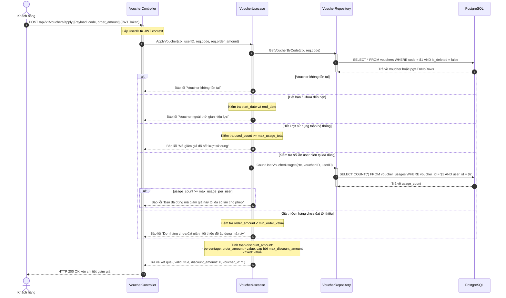
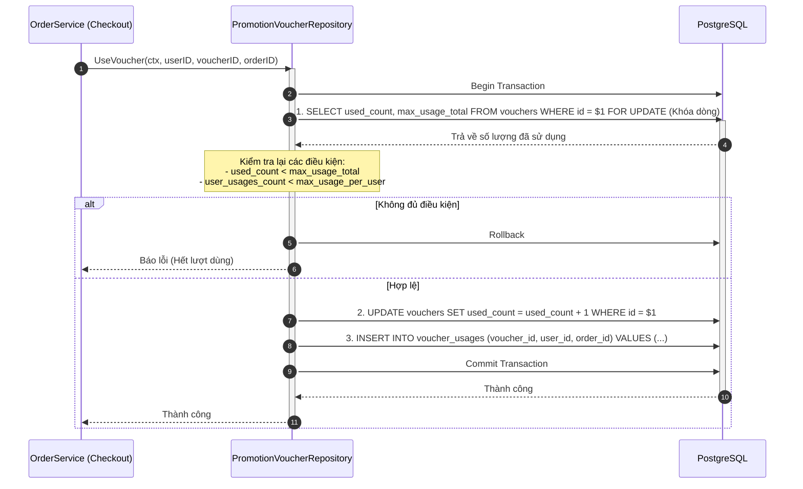

# Thiết Kế Chi Tiết Luồng Khuyến Mãi & Voucher (Promotion & Voucher Module Design)

Tài liệu này mô tả chi tiết thiết kế hệ thống luồng dữ liệu nghiệp vụ cho module **Khuyến mãi (Promotion)** và **Mã giảm giá (Voucher)**.

---

## 1. Cấu Trúc Cơ Sở Dữ Liệu (Schema)

Các bảng liên quan đã được định nghĩa sẵn trong cơ sở dữ liệu:

```sql
-- 1. Khuyến mãi tự động áp dụng trên sản phẩm/biến thể
CREATE TABLE promotions (
    id SERIAL PRIMARY KEY,
    product_id VARCHAR(50) NOT NULL REFERENCES product(id) ON DELETE CASCADE,
    variant_id INTEGER REFERENCES product_variant(id) ON DELETE CASCADE,
    name VARCHAR(255) NOT NULL,
    description TEXT,
    discount_type VARCHAR(50) NOT NULL,    -- "percentage", "fixed"
    discount_value NUMERIC(15, 2) NOT NULL,
    start_date TIMESTAMPTZ NOT NULL,
    end_date TIMESTAMPTZ NOT NULL,
    is_active BOOLEAN NOT NULL DEFAULT TRUE,
    is_deleted BOOLEAN NOT NULL DEFAULT FALSE
);

-- 2. Mã giảm giá khách hàng nhập thủ công khi thanh toán
CREATE TABLE vouchers (
    id SERIAL PRIMARY KEY,
    code VARCHAR(50) UNIQUE NOT NULL,
    name VARCHAR(255) NOT NULL,
    start_date TIMESTAMPTZ NOT NULL,
    end_date TIMESTAMPTZ NOT NULL,
    discount_type VARCHAR(50) NOT NULL,    -- "percentage", "fixed"
    discount_value NUMERIC(15, 2) NOT NULL,
    discount_target VARCHAR(50) NOT NULL DEFAULT 'order', -- "order", "shipping"
    min_order_value NUMERIC(15, 2) NOT NULL DEFAULT 0,
    max_discount_amount NUMERIC(15, 2),    -- giới hạn số tiền giảm tối đa (nếu dùng percentage)
    max_usage_total INTEGER,               -- tổng lượt sử dụng tối đa của voucher
    max_usage_per_user INTEGER NOT NULL DEFAULT 1, -- số lượt sử dụng tối đa của 1 user
    used_count INTEGER NOT NULL DEFAULT 0,
    is_deleted BOOLEAN NOT NULL DEFAULT FALSE
);

-- 3. Lưu vết lịch sử sử dụng voucher
CREATE TABLE voucher_usages (
    id SERIAL PRIMARY KEY,
    voucher_id INTEGER NOT NULL REFERENCES vouchers(id) ON DELETE CASCADE,
    user_id INTEGER NOT NULL REFERENCES users(id) ON DELETE CASCADE,
    order_id INTEGER NOT NULL REFERENCES orders(id) ON DELETE CASCADE,
    used_at TIMESTAMPTZ NOT NULL DEFAULT NOW(),
    UNIQUE (voucher_id, user_id, order_id)
);
```

---

## 2. Các API Endpoints

### 2.1 Quản trị viên (Admin - Chỉ Admin)
* `POST /api/v1/admin/promotions` - Tạo chương trình khuyến mãi sản phẩm.
* `GET /api/v1/admin/promotions` - Xem danh sách chương trình khuyến mãi.
* `PUT /api/v1/admin/promotions/:id` - Cập nhật chương trình khuyến mãi.
* `DELETE /api/v1/admin/promotions/:id` - Xóa chương trình khuyến mãi (Xóa mềm `is_deleted = true`).

* `POST /api/v1/admin/vouchers` - Tạo mã giảm giá mới.
* `GET /api/v1/admin/vouchers` - Xem danh sách mã giảm giá.
* `PUT /api/v1/admin/vouchers/:id` - Cập nhật mã giảm giá.
* `DELETE /api/v1/admin/vouchers/:id` - Xóa mã giảm giá (Xóa mềm `is_deleted = true`).

### 2.2 Người dùng (Public / Customer)
* `GET /api/v1/vouchers` - Lấy danh sách các voucher đang kích hoạt và còn hiệu lực (Public).
* `POST /api/v1/vouchers/apply` - Xác thực và tính toán số tiền giảm giá của voucher (Yêu cầu JWT Token).
  * *Request Body*: `{"code": "SUMMER50", "order_amount": 1200000}`
  * *Response*: `{ "valid": true, "discount_amount": 100000, "voucher_id": 2 }` hoặc báo lỗi cụ thể nếu voucher không hợp lệ/hết lượt.

---

## 3. Thiết Kế Luồng Nghiệp Vụ & Sơ đồ Tuần tự (Sequence Diagrams)

### 3.1 Luồng Áp dụng và Xác thực Voucher (Voucher Application Flow)

Hệ thống tiến hành xác thực voucher qua các bước nghiêm ngặt:
1. Kiểm tra tồn tại, kích hoạt (`is_active = true`), chưa xóa mềm (`is_deleted = false`).
2. Kiểm tra khoảng thời gian hiệu lực (`start_date <= NOW() <= end_date`).
3. Kiểm tra tổng số lần sử dụng voucher (`used_count < max_usage_total`).
4. Kiểm tra giới hạn số lần sử dụng của người dùng đó (Query `voucher_usages` count).
5. Kiểm tra giá trị đơn hàng tối thiểu (`order_amount >= min_order_value`).
6. Tính toán số tiền được giảm giá (`discount_amount`) theo percentage hoặc fixed, giới hạn bởi `max_discount_amount`.



### 3.2 Luồng Tiêu dùng Voucher tránh Race Condition khi Đặt hàng (Checkout Concurrency Handling)

Khi khách hàng bấm đặt hàng thực tế (Checkout), hệ thống sẽ gọi phương thức tiêu dùng voucher `UseVoucher`. Để tránh trường hợp 2 khách hàng đồng thời đặt hàng và vượt quá giới hạn voucher (Race Condition), hệ thống sẽ thực hiện khóa dòng (`SELECT FOR UPDATE`) đối với bản ghi voucher trong PostgreSQL.



---

## 4. Đặc Tả Lớp & Cấu Trúc Dữ Liệu (UML Class Diagram)

```mermaid
classDiagram
    direction BT

    class Promotion {
        +int ID
        +string ProductID
        +int* VariantID
        +string Name
        +string* Description
        +string DiscountType
        +float64 DiscountValue
        +Time StartDate
        +Time EndDate
        +bool IsActive
        +bool IsDeleted
    }

    class Voucher {
        +int ID
        +string Code
        +string Name
        +Time StartDate
        +Time EndDate
        +string DiscountType
        +float64 DiscountValue
        +string DiscountTarget
        +float64 MinOrderValue
        +float64* MaxDiscountAmount
        +int* MaxUsageTotal
        +int MaxUsagePerUser
        +int UsedCount
        +bool IsDeleted
    }

    class CreatePromotionRequest {
        +string ProductID
        +int* VariantID
        +string Name
        +string* Description
        +string DiscountType
        +float64 DiscountValue
        +Time StartDate
        +Time EndDate
        +bool IsActive
    }

    class UpdatePromotionRequest {
        +string Name
        +string* Description
        +string DiscountType
        +float64 DiscountValue
        +Time StartDate
        +Time EndDate
        +bool IsActive
    }

    class CreateVoucherRequest {
        +string Code
        +string Name
        +Time StartDate
        +Time EndDate
        +string DiscountType
        +float64 DiscountValue
        +string DiscountTarget
        +float64 MinOrderValue
        +float64* MaxDiscountAmount
        +int* MaxUsageTotal
        +int MaxUsagePerUser
    }

    class UpdateVoucherRequest {
        +string Name
        +Time StartDate
        +Time EndDate
        +string DiscountType
        +float64 DiscountValue
        +string DiscountTarget
        +float64 MinOrderValue
        +float64* MaxDiscountAmount
        +int* MaxUsageTotal
        +int MaxUsagePerUser
    }

    class ApplyVoucherRequest {
        +string Code
        +float64 OrderAmount
    }

    class ApplyVoucherResponse {
        +bool Valid
        +float64 DiscountAmount
        +int VoucherID
    }

    class PromotionVoucherController {
        -PromotionVoucherUsecase usecase
        +CreatePromotion(ctx: *gin.Context) void
        +ListPromotions(ctx: *gin.Context) void
        +UpdatePromotion(ctx: *gin.Context) void
        +DeletePromotion(ctx: *gin.Context) void
        +CreateVoucher(ctx: *gin.Context) void
        +ListVouchers(ctx: *gin.Context) void
        +UpdateVoucher(ctx: *gin.Context) void
        +DeleteVoucher(ctx: *gin.Context) void
        +ListActiveVouchers(ctx: *gin.Context) void
        +ApplyVoucher(ctx: *gin.Context) void
    }

    class PromotionVoucherUsecase {
        <<interface>>
        +CreatePromotion(ctx: Context, req: *CreatePromotionRequest) (*Promotion, error)
        +ListPromotions(ctx: Context) ([]*Promotion, error)
        +UpdatePromotion(ctx: Context, id: int, req: *UpdatePromotionRequest) (*Promotion, error)
        +DeletePromotion(ctx: Context, id: int) error
        
        +CreateVoucher(ctx: Context, req: *CreateVoucherRequest) (*Voucher, error)
        +ListVouchers(ctx: Context) ([]*Voucher, error)
        +UpdateVoucher(ctx: Context, id: int, req: *UpdateVoucherRequest) (*Voucher, error)
        +DeleteVoucher(ctx: Context, id: int) error
        +ListActiveVouchers(ctx: Context) ([]*Voucher, error)
        +ApplyVoucher(ctx: Context, userID int, code string, orderAmount float64) (*ApplyVoucherResponse, error)
        +UseVoucher(ctx: Context, userID int, voucherID int, orderID int) error
        +ReleaseVoucher(ctx: Context, userID int, voucherID int, orderID int) error
    }

    class PromotionVoucherRepository {
        <<interface>>
        +CreatePromotion(ctx: Context, p: *Promotion) (*Promotion, error)
        +ListPromotions(ctx: Context) ([]*Promotion, error)
        +GetPromotionByID(ctx: Context, id int) (*Promotion, error)
        +UpdatePromotion(ctx: Context, p: *Promotion) (*Promotion, error)
        +DeletePromotion(ctx: Context, id int) error
        
        +CreateVoucher(ctx: Context, v: *Voucher) (*Voucher, error)
        +ListVouchers(ctx: Context) ([]*Voucher, error)
        +GetVoucherByID(ctx: Context, id int) (*Voucher, error)
        +GetVoucherByCode(ctx: Context, code string) (*Voucher, error)
        +UpdateVoucher(ctx: Context, v: *Voucher) (*Voucher, error)
        +DeleteVoucher(ctx: Context, id int) error
        +ListActiveVouchers(ctx: Context) ([]*Voucher, error)
        +CountUserVoucherUsages(ctx: Context, voucherID int, userID int) (int, error)
        +UseVoucher(ctx: Context, userID int, voucherID int, orderID int) error
        +ReleaseVoucher(ctx: Context, userID int, voucherID int, orderID int) error
    }

    PromotionVoucherController --> PromotionVoucherUsecase : calls
    PromotionVoucherUsecase --> PromotionVoucherRepository : calls
```


