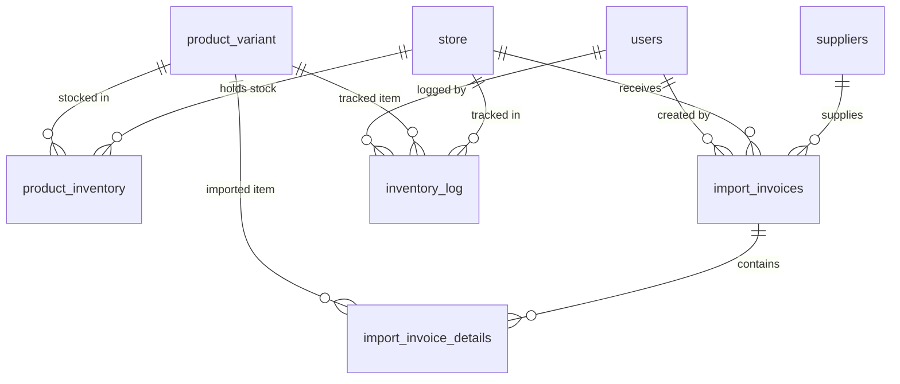
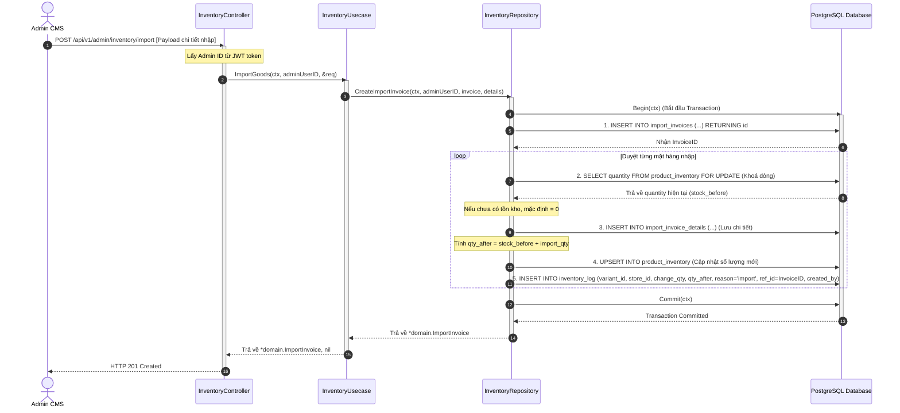
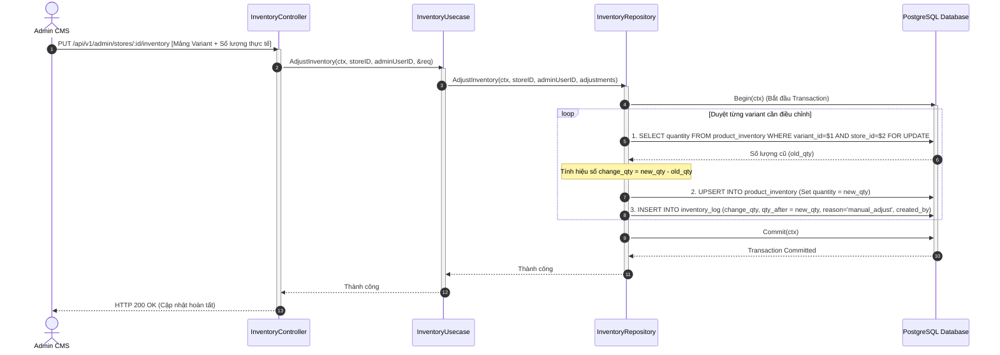
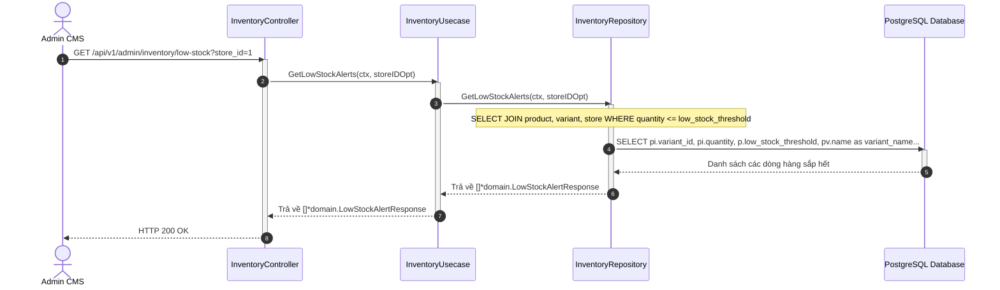
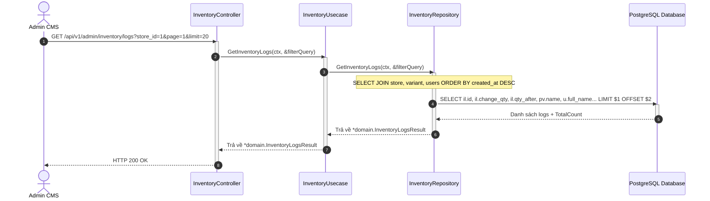
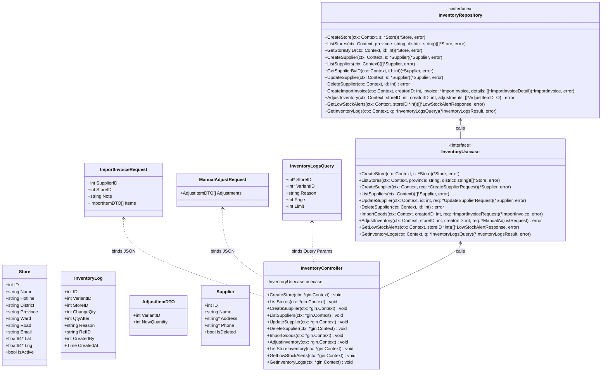

# Thiết Kế Chi Tiết Luồng Store & Inventory (Store & Inventory Module Design)
*Bổ sung tính năng Nhật ký tồn kho (Inventory Log), Xem lại hoá đơn nhập, Cảnh báo hàng thấp và Lịch sử thay đổi*

Tài liệu này mô tả chi tiết thiết kế hệ thống luồng dữ liệu nghiệp vụ cho module **Cửa hàng (Store)** và **Tồn kho (Inventory)**, bổ sung cơ chế lưu vết thay đổi kho (Inventory Log) và 3 tính năng quản trị kho nâng cao.

---

## 1. Cấu Trúc Cơ Sở Dữ Liệu Bổ Sung (Schema Change)

Hệ thống bổ sung bảng `inventory_log` để lưu vết mọi thay đổi số lượng tồn kho (nhập, xuất, kiểm kho, điều chỉnh thủ công):

```sql
CREATE TABLE inventory_log (
    id SERIAL PRIMARY KEY,
    variant_id INTEGER NOT NULL REFERENCES product_variant(id) ON DELETE CASCADE,
    store_id INTEGER NOT NULL REFERENCES store(id) ON DELETE CASCADE,
    change_qty INTEGER NOT NULL,      -- Số lượng thay đổi: dương = nhập, âm = xuất/bán
    qty_after INTEGER NOT NULL,       -- Số lượng tồn kho snapshot ngay sau khi thay đổi
    reason VARCHAR(100) NOT NULL,     -- Lý do: "import", "manual_adjust", "order_confirmed", "order_cancelled"
    ref_id VARCHAR(100),              -- ID tham chiếu: mã hóa đơn nhập hoặc mã đơn hàng tương ứng
    created_by INTEGER NOT NULL REFERENCES users(id),
    created_at TIMESTAMPTZ NOT NULL DEFAULT NOW()
);

-- Index để tối ưu truy vấn lịch sử
CREATE INDEX idx_inventory_log_store_var ON inventory_log(store_id, variant_id);
CREATE INDEX idx_inventory_log_created ON inventory_log(created_at DESC);
```

---

## 2. Sơ đồ Quan hệ Thực thể Cập nhật (Updated Entity Relationships)



---

## 3. Các API Endpoints Bổ Sung

### 3.1 Cửa hàng & Nhà cung cấp (Stores & Suppliers CRUD)
* `GET /api/v1/stores` - Xem danh sách cửa hàng (Public).
* `POST /api/v1/admin/stores` - Thêm cửa hàng (Chỉ Admin).
* `PUT /api/v1/admin/stores/:id` - Sửa cửa hàng (Chỉ Admin).
* `DELETE /api/v1/admin/stores/:id` - Tạm dừng cửa hàng (`is_active = false`) (Chỉ Admin).
* `POST /api/v1/admin/suppliers` - Thêm nhà cung cấp (Chỉ Admin).
* `GET /api/v1/admin/suppliers` - Xem danh sách nhà cung cấp (Chỉ Admin).
* `PUT /api/v1/admin/suppliers/:id` - Cập nhật nhà cung cấp (Chỉ Admin).
* `DELETE /api/v1/admin/suppliers/:id` - Tạm dừng nhà cung cấp (`is_deleted = true`) (Chỉ Admin).

### 3.2 Tồn kho & Hoá đơn & Logs (Inventory & Logs)
* `GET /api/v1/admin/stores/:id/inventory` - Xem danh sách tồn kho cửa hàng (Chỉ Admin).
* `PUT /api/v1/admin/stores/:id/inventory` - Điều chỉnh tồn kho thủ công (Tự động ghi nhận `manual_adjust` vào `inventory_log`) (Chỉ Admin).
* `POST /api/v1/admin/inventory/import` - Tạo hóa đơn nhập kho & Tự động cộng kho & Ghi nhận `import` log (Chỉ Admin).
* `GET /api/v1/admin/inventory/imports` - Xem danh sách hoá đơn nhập hàng (Chỉ Admin).
* `GET /api/v1/admin/inventory/imports/:id` - Xem chi tiết 1 hoá đơn nhập (kèm danh sách chi tiết hàng nhập) (Chỉ Admin).
* `GET /api/v1/admin/inventory/low-stock` - **Cảnh báo hàng thấp**: Xem các variant có tồn kho `<= low_stock_threshold` của sản phẩm đó (Chỉ Admin).
* `GET /api/v1/admin/inventory/logs` - **Lịch sử thay đổi tồn kho**: Xem toàn bộ lịch sử biến động kho (Phân trang, lọc theo store, variant, lý do) (Chỉ Admin).

---

## 4. Thiết Kế Luồng Nghiệp Vụ & Sơ đồ Tuần tự (Sequence Diagrams)

### 4.1 Luồng Thêm Hoá Đơn Nhập Hàng & Lưu Log (Import Goods Flow with Log)

Khi có hàng nhập về, luồng xử lý sẽ ghi nhận vào bảng Hoá đơn, tăng tồn kho hiện tại và chèn log vào bảng `inventory_log` để kiểm soát lịch sử.



---

### 4.2 Luồng Điều chỉnh Tồn kho thủ công & Ghi Log (Manual Stock Adjust Flow)

CMS cung cấp giao diện cho Admin điều chỉnh lại tồn kho khi đối soát kiểm kho thực tế. Hệ thống so sánh số lượng mới và cũ để tính ra hiệu số `change_qty` và ghi nhận log `manual_adjust`.



---

### 4.3 Luồng Cảnh Báo Hàng Thấp (Low Stock Alert Flow)

Hệ thống so sánh số lượng còn lại trong kho của từng phiên bản tại từng cửa hàng (`product_inventory.quantity`) với ngưỡng cảnh báo hàng thấp (`product.low_stock_threshold`) để gửi cảnh báo.



---

### 4.4 Luồng Xem Lịch sử Thay đổi Kho (Inventory Logs History Flow)

Cho phép quản trị viên xem chi tiết quá trình biến động kho, hỗ trợ phân trang và tìm kiếm theo cửa hàng hoặc biến thể sản phẩm.



---

## 5. Đặc Tả Lớp & Cấu Trúc Dữ Liệu Cập Nhật (UML Class Diagram)


