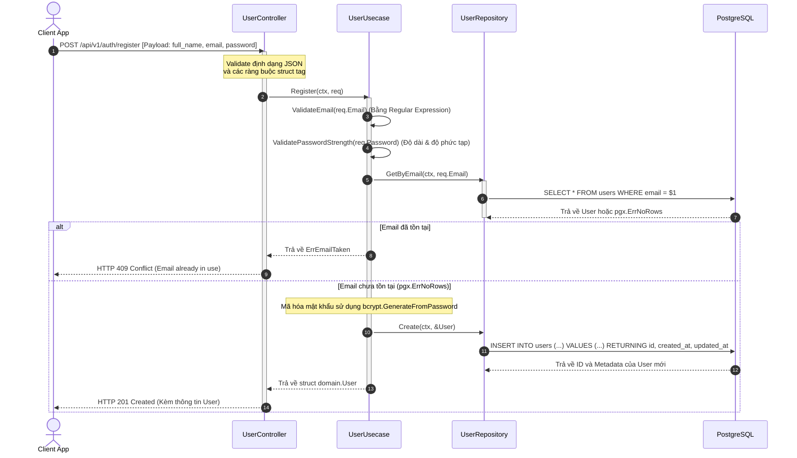
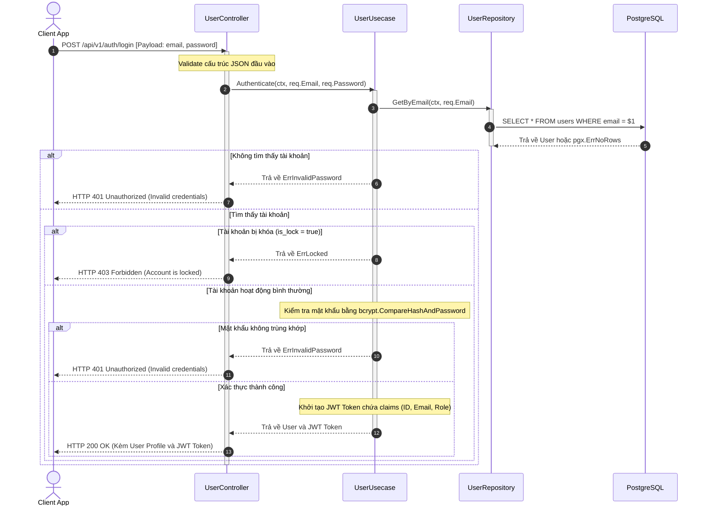
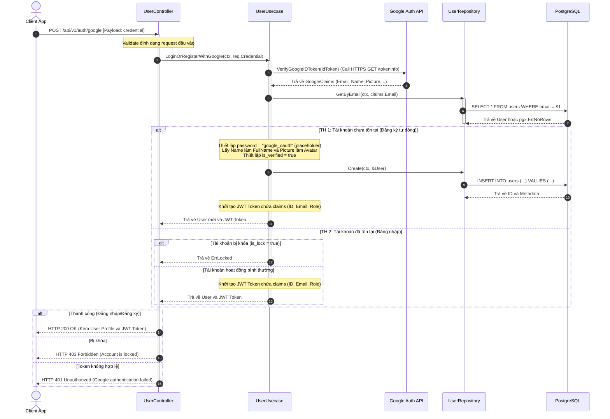
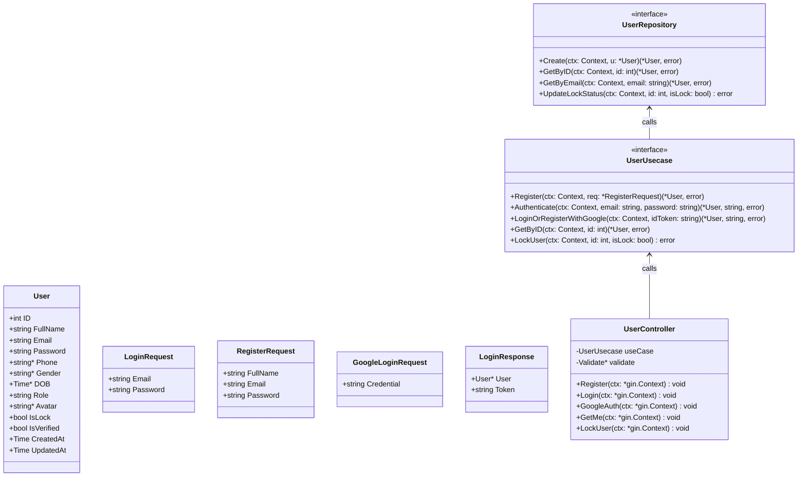

# Thiết Kế Chi Tiết Luồng Xác Thực và Người Dùng (User & Auth Module Design)

Tài liệu này mô tả chi tiết thiết kế hệ thống luồng dữ liệu nghiệp vụ cho module **Người dùng và Xác thực (User & Auth)**, hỗ trợ đăng ký/đăng nhập truyền thống bằng Email/Mật khẩu và cơ chế đăng nhập/đăng ký hợp nhất không mật khẩu bằng Google OAuth, tích hợp cơ chế kiểm tra hợp lệ dữ liệu (validation) nghiêm ngặt ở phía Backend.

---

## 1. Cấu Trúc Cơ Sở Dữ Liệu (Schema)

Bảng `users` quản lý thông tin tài khoản người dùng và phân quyền trong hệ thống:

```sql
CREATE TABLE users (
    id SERIAL PRIMARY KEY,
    full_name VARCHAR(100) NOT NULL,
    email VARCHAR(100) NOT NULL UNIQUE,
    password VARCHAR(100) NOT NULL,
    phone VARCHAR(20),
    gender VARCHAR(10),
    dob DATE,
    role VARCHAR(20) NOT NULL DEFAULT 'customer',
    avatar VARCHAR(255),
    is_lock BOOLEAN NOT NULL DEFAULT FALSE,
    is_verified BOOLEAN NOT NULL DEFAULT FALSE,
    created_at TIMESTAMPTZ NOT NULL DEFAULT NOW(),
    updated_at TIMESTAMPTZ NOT NULL DEFAULT NOW()
);

-- Chỉ mục tối ưu hóa truy vấn
CREATE INDEX idx_users_email ON users(email);
```

> [!NOTE]
> Bảng `users` có một số đặc điểm thiết kế như sau:
> - Trường `password` lưu trữ chuỗi băm (hash) bảo mật bằng thuật toán **bcrypt** cho tài khoản đăng ký truyền thống.
> - Đối với tài khoản liên kết **Google OAuth**, do trường `password` có ràng buộc `NOT NULL`, hệ thống sẽ lưu giá trị mặc định là `"google_oauth"`. Giá trị này không phải một bcrypt băm hợp lệ, giúp ngăn chặn tuyệt đối việc đăng nhập bằng mật khẩu trực tiếp cho các tài khoản dùng Google.
> - Trường `is_verified` được đặt mặc định là `false` với tài khoản thường và tự động là `true` với tài khoản liên kết Google (do Google đã xác thực email trước đó).

---

## 2. Các API Endpoints

Mọi endpoint liên quan đến xác thực và thông tin người dùng được cấu hình dưới nhóm đường dẫn `/api/v1`:

* `POST /api/v1/auth/register` - Đăng ký tài khoản truyền thống (Email & Mật khẩu).
  * *Request Body*: `{"full_name": "Nguyen Van A", "email": "user@example.com", "password": "Password123!"}`
* `POST /api/v1/auth/login` - Đăng nhập tài khoản truyền thống (Email & Mật khẩu).
  * *Request Body*: `{"email": "user@example.com", "password": "Password123!"}`
* `POST /api/v1/auth/google` - Xác thực liên kết Google OAuth (Tự động Đăng ký nếu chưa có tài khoản, hoặc Đăng nhập nếu tài khoản đã tồn tại).
  * *Request Body*: `{"credential": "google-id-token"}`
* `GET /api/v1/profile` - Xem thông tin chi tiết tài khoản hiện tại (Yêu cầu Header `Authorization: Bearer <JWT_TOKEN>`).
* `PUT /api/v1/admin/users/:id/lock` - Khóa hoặc mở khóa tài khoản người dùng (Yêu cầu quyền Admin).
  * *Request Body*: `{"is_lock": true}`

---

## 3. Thiết Kế Luồng Nghiệp Vụ & Sơ đồ Tuần tự (Sequence Diagrams)

### 3.1 Luồng Đăng Ký và Đăng Nhập Truyền Thống (Traditional Auth Flow)

#### A. Luồng Đăng Ký (Register Flow)
Hệ thống thực hiện kiểm tra định dạng email và độ mạnh của mật khẩu trước khi kiểm tra trùng lặp email trong cơ sở dữ liệu. Mật khẩu sau đó được mã hóa qua bcrypt trước khi lưu trữ.



#### B. Luồng Đăng Nhập (Login Flow)
Xác thực thông tin email và so sánh mật khẩu được gửi lên với chuỗi băm trong DB. Nếu thành công, sinh mã Token ứng dụng (JWT) để trả về cho Client.



---

### 3.2 Luồng Xác Thực Hợp Nhất Google OAuth (Unified Google OAuth Flow)

Quy trình đăng ký và đăng nhập qua Google hoạt động hoàn toàn không mật khẩu (**passwordless**) thông qua một API duy nhất. Hệ thống tự động phát hiện người dùng mới để đăng ký, hoặc đăng nhập trực tiếp nếu tài khoản đã tồn tại.



---

## 4. Đặc Tả Lớp & Cấu Trúc Dữ Liệu (UML Class Diagram)

Sơ đồ lớp dưới đây thể hiện các mối liên kết giữa Controller, Usecase, Repository và các cấu trúc dữ liệu yêu cầu/phản hồi:



---

## 5. Quy Tắc Kiểm Tra Hợp Lệ Dữ Liệu (Validation Rules)

Toàn bộ thông tin đầu vào từ client gửi lên sẽ được kiểm tra ở tầng Usecase trước khi thực hiện truy vấn cơ sở dữ liệu.

### 5.1 Xác Thực Định Dạng Email
* Email được kiểm tra theo biểu thức chính quy (Regular Expression) tiêu chuẩn:
  `^[a-zA-Z0-9._%+-]+@[a-zA-Z0-9.-]+\.[a-zA-Z]{2,}$`
* Nếu sai định dạng, hệ thống phản hồi mã lỗi `400 Bad Request` kèm thông báo lỗi của [ErrInvalidEmail](file:///d:/Project/Go-Project/backend/domain/errors.go#L14).

### 5.2 Kiểm Tra Độ Mạnh Của Mật Khẩu (Password Strength)
Đối với đăng ký bằng tài khoản thường, mật khẩu phải thỏa mãn đầy đủ các điều kiện bảo mật được kiểm tra bởi hàm [ValidatePasswordStrength](file:///d:/Project/Go-Project/backend/internal/utils/validation.go#L21):
1. **Độ dài**: Tối thiểu 8 ký tự.
2. **Ký tự hoa**: Chứa ít nhất một ký tự viết hoa (`[A-Z]`).
3. **Ký tự thường**: Chứa ít nhất một ký tự viết thường (`[a-z]`).
4. **Ký tự số**: Chứa ít nhất một ký tự số (`[0-9]`).
5. **Ký tự đặc biệt**: Chứa ít nhất một ký tự đặc biệt hoặc dấu câu (ví dụ: `!`, `@`, `#`, `$`, `%`, `*`,...).
* Nếu không thỏa mãn bất kỳ điều kiện nào, hệ thống phản hồi lỗi `400 Bad Request` kèm thông báo của [ErrWeakPassword](file:///d:/Project/Go-Project/backend/domain/errors.go#L13).
