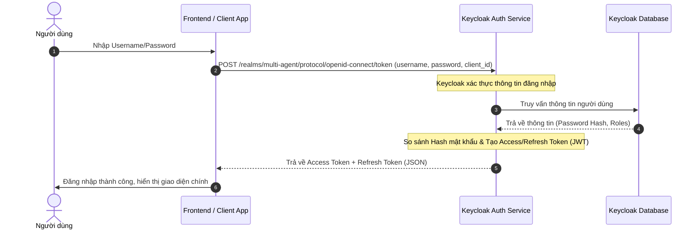
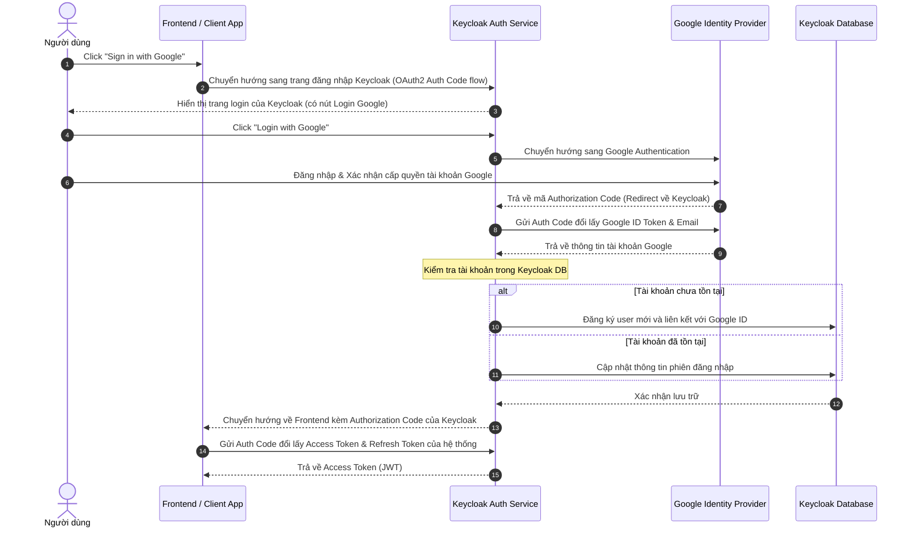
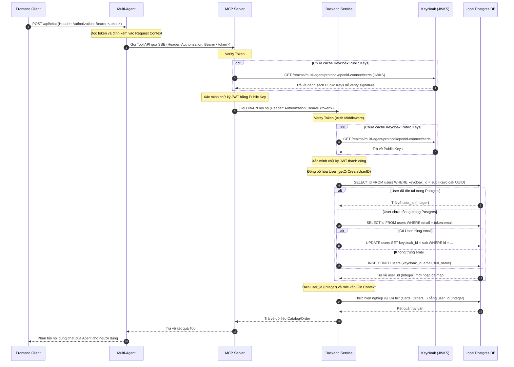

# Tài liệu Tích hợp Xác thực Keycloak OIDC

Tài liệu này mô tả chi tiết luồng hoạt động xác thực (Authentication) và phân quyền (Authorization) sử dụng Keycloak OIDC cho hệ thống của chúng ta.

---

## 1. Luồng đăng nhập thông thường (Direct Access Grant / Password Flow)
Luồng này thường được sử dụng cho việc kiểm thử tự động, công cụ CLI hoặc đăng nhập trực tiếp qua API.

---

## 2. Luồng đăng nhập bằng Google (OIDC Federation)
Luồng này sử dụng phương thức Authorization Code Flow phối hợp giữa Keycloak (như một Broker) và Google Identity Provider.

---

## 3. Luồng gọi API có xác thực (API Gateway & Microservices Verification)
Luồng này mô tả cách các dịch vụ (`backend`, `multi-agent`, `mcp-server`) xác thực token được gửi từ Frontend, đồng thời tự động đồng bộ tài khoản người dùng vào DB local của Backend.

