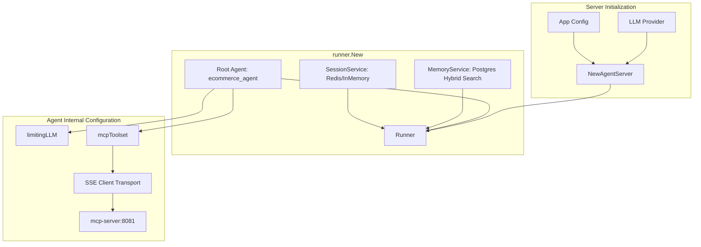
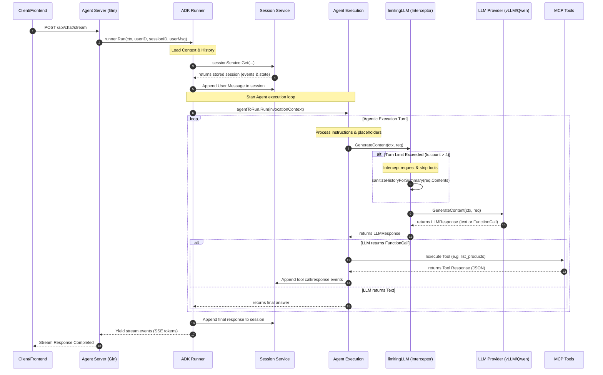

# ADK Runner Architecture Guide

This document explains the architecture and design of the Google ADK (Agent Development Kit) framework used in the `single-agent` workspace. Use this guide to understand how components interact and where to apply custom logic.

---

## 1. Initialization and Component Relationship

When the server starts, it initializes the `Runner` by wire-framing several core modules. Here is how they relate to each other:



---

## 2. Request Execution Flow (runner.Run)

When a chat message arrives, the `Runner` manages the conversation lifecycle. The following sequence shows how context, history, and tools flow during `runner.Run`:



---

## 3. Core Component Roles

| Component | Responsibility | Customization Target |
| :--- | :--- | :--- |
| **`Runner`** | Manages invocation context, handles early exits (via plugins), and orchestrates user input ingestion. | Flow-level interceptors, custom event tracing, and distributed execution. |
| **`Agent`** | System prompt assembly (Instructions) and coordinating with LLM + Toolsets. | Prompt templates, role declarations, and input/output schema validation rules. |
| **`SessionService`** | Stores conversation history (`events`) and workspace variables (`state`). | Swapping storage backends (Redis for transient sessions, Postgres for long-term tracking). |
| **`MemoryService`** | Postgres hybrid vector and keyword search provider for retrieval augmented generation (RAG). | Tuning retrieval parameters (Top-K, hybrid search weights like BM25 vs Vector). |
| **`LLM`** | Calls the actual model API. | Model wrappers (like `limitingLLM`) for request-level preprocessing, rate-limiting, and error fallback. |
| **`Toolset`** | Connects external APIs/functions to the LLM. | Registering new local functions or adding SSE endpoints to MCP. |

---

## 4. Customization Blueprint

Use this guide to determine where to place your code for typical customization scenarios:

### A. I want to add custom authorization/logging headers to MCP tools
* **Where to edit:** [single-agent/server/agent_handler.go](file:///e:/workspace/AI/Learn-Go/single-agent/server/agent_handler.go) inside `headerTransport.RoundTrip()`.

### B. I want to limit model context window size or compress old history
* **Where to edit:** [single-agent/server/agent_handler.go](file:///e:/workspace/AI/Learn-Go/single-agent/server/agent_handler.go) inside `limitingLLM.GenerateContent()`. Slice or rewrite `req.Contents` before forwarding to the underlying LLM.

### C. I want to store chat history in Postgres in a custom relational database format
* **Where to edit:** [single-agent/server/agent_handler.go](file:///e:/workspace/AI/Learn-Go/single-agent/server/agent_handler.go) inside `HandlerChatStream` (where we catch client abortion) and inside the main HTTP response flow. Call your database repository directly using a background context.

---

## 5. ADK Plugins (Global Middleware)

ADK provides a global middleware pattern through the `plugin.Plugin` package. If you register a plugin inside `PluginConfig.Plugins` during `Runner` creation, you can hook into the runner's execution lifecycle:

```go
import "google.golang.org/adk/plugin"

myPlugin, _ := plugin.New(plugin.Config{
    Name: "global-logger-plugin",
    BeforeRunCallback: func(ctx context.Context) error {
        // Run at the beginning of runner.Run(...)
        return nil
    },
    AfterRunCallback: func(ctx context.Context) error {
        // Run at the end of runner.Run(...)
        return nil
    },
    OnUserMessageCallback: func(ctx agent.InvocationContext, msg *genai.Content) (*genai.Content, error) {
        // Intercept and optionally modify user inputs globally
        return msg, nil
    },
    OnEventCallback: func(ctx agent.InvocationContext, event *session.Event) (*session.Event, error) {
        // Triggered on every event generated (tokens, steps, confirmations)
        return event, nil
    },
})
```

### Hooks List
- **Run Lifecycle**: `BeforeRunCallback`, `AfterRunCallback`
- **Agent Lifecycle**: `BeforeAgentCallback`, `AfterAgentCallback`
- **Model Lifecycle**: `BeforeModelCallback`, `AfterModelCallback`, `OnModelErrorCallback`
- **Tool Lifecycle**: `BeforeToolCallback`, `AfterToolCallback`, `OnToolErrorCallback`
- **User Message Lifecycle**: `OnUserMessageCallback`
- **Event Dispatcher**: `OnEventCallback`

