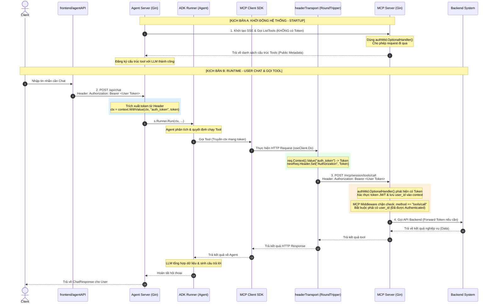

# Luồng Xác Thực (Authentication Flow) & Truyền Token trong Multi-Agent System

Tài liệu này mô tả chi tiết thiết kế bảo mật cho hệ thống Multi-Agent, cách JWT Token của người dùng (User) được truyền tự động và an toàn qua nhiều lớp dịch vụ: từ **Client (Frontend)** $\rightarrow$ **Agent Server** $\rightarrow$ **MCP Server** $\rightarrow$ **Backend**.

---

## 1. Biểu Đồ Trực Quan (Mermaid Sequence Diagram)

---

## 2. Chi Tiết Thiết Kế Từng Lớp

### Lớp A: Client (Frontend)
* **File liên quan:** [agentAPI.ts](file:///d:/Project/Go-Project/frontend/src/services/agentAPI.ts)
* **Nhiệm vụ:**
  * Lấy JWT token hiện tại của user từ `tokenManager.getToken()`.
  * Chèn Token vào header `Authorization: Bearer <token>` cho mọi cuộc gọi chat (`/api/chat` và `/api/chat/confirm`).

### Lớp B: Agent Server (Bố trí Context Propagation)
* **File liên quan:** [agent_handler.go](file:///d:/Project/Go-Project/single-agent/server/agent_handler.go)
* **Nhiệm vụ:**
  1. **Trích xuất Token:** Đọc `Authorization` từ HTTP Header gửi tới, lưu vào `context.Context` thông qua một khóa định danh riêng (`contextKeyAuthToken`).
  2. **Truyền dọc Context:** Chuyển tiếp Context này vào `Runner.Run(ctx, ...)` của ADK. Khi ADK gọi MCP SDK, context này sẽ tự động được mang theo.
  3. **Tiêm Token động tại RoundTripper:** Đối tượng `headerTransport` triển khai `http.RoundTripper` chặn mọi request đi ra từ MCP SDK sang MCP Server. Nếu phát hiện `auth_token` trong Context của request, nó sẽ đè lại header `Authorization` bằng Token thật của User hiện tại.

### Lớp C: MCP Server (Bảo vệ theo Phân Quyền Endpoint)
* **File liên quan:** [main.go](file:///d:/Project/Go-Project/mcp-server/cmd/main.go) & [mcp_handler.go](file:///d:/Project/Go-Project/mcp-server/internal/server/mcp_handler.go)
* **Nhiệm vụ:**
  1. **Xác thực tùy chọn (Optional Authentication):** Route `/mcp` sử dụng `OptionalHandler()`. 
     * Nếu không truyền token (lúc khởi động hệ thống từ Agent Server), request vẫn đi qua để lấy danh sách Tool mô tả (Public Metadata).
     * Nếu có truyền token, tiến hành giải mã và xác thực chữ ký JWT. Nếu đúng, lưu `user_id` vào Context.
  2. **Kiểm tra nghiệp vụ (Action Authorization):** Một Middleware MCP kiểm soát tất cả các lệnh gọi.
     * Khi nhận được phương thức `"tools/call"` (thực thi hành động thật), middleware yêu cầu bắt buộc phải tồn tại `user_id` trong context.
     * Nếu không có (do token không hợp lệ hoặc thiếu), từ chối ngay lập tức bằng lỗi `401/Unauthorized`.

---

## 3. Các Ưu Điểm Của Thiết Kế Này (Trade-offs)
* **Không dùng System/Admin Token tĩnh:** Tránh hoàn toàn việc lưu cấu hình Token hệ thống dài hạn ở file cấu hình `.env` của backend. Mọi hành động thao tác dữ liệu đều chạy dưới danh nghĩa (on behalf of) của chính người dùng hiện tại.
* **Tối ưu hóa Startup:** Việc tách biệt quyền của `ListTools` giúp Agent Server khởi chạy mượt mà ngay lập tức mà không cần phụ thuộc vào bất kỳ phiên đăng nhập nào của Client.
* **An toàn tuyệt đối:** Chỉ cho phép xem cấu trúc của tool (public schema) mà không cho phép bất kỳ ai chạy tool lấy dữ liệu nếu không cung cấp một Token hợp lệ đã được xác thực qua Keycloak.
